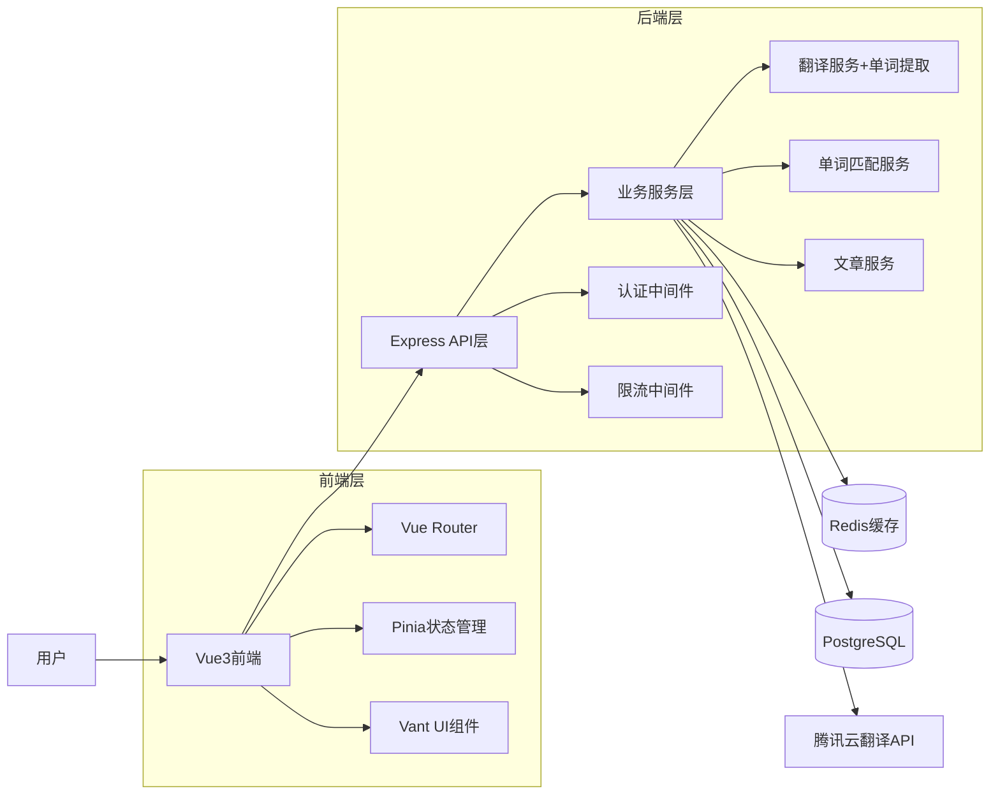

# 🧭《5S + 6A AI开发流程规范》

> **适用项目**: 完形填空学习系统 (Vue3 + Node.js + TypeScript)  
> **文档版本**: v1.0  
> **更新时间**: 2024年12月

## 📌 目录结构规范

```
/docs/
│
├── 说明文档.md        ← 项目总览与需求记录（S1）
├── 设计文档.md        ← 系统架构与模块设计（S2）
├── 接口文档.md        ← API定义与参数规范（S3）
├── TASK_XX.md         ← 单任务执行文件，可多份（S4）
├── 验收文档.md        ← 测试与交付验证（S5）
└── README_5S+6A_AI_DEV_GUIDE.md  ← 本规范说明文件
```

---

## 🚀 一、5S 文档规范模板

### 🧩 S1：《说明文档.md》

```markdown
# 📘 说明文档

## 一、项目概述
- **项目名称**: 作文学习系统
- **主要目标**: 提供英语作文学习平台，支持段落翻译和单词学习
- **技术栈**: Vue3 + TypeScript + Node.js + Express + PostgreSQL + Redis
- **交付时间**: 2025年10月24日

## 二、需求对齐（5W1H）
| 维度 | 内容 |
|------|------|
| Who（用户） | 英语学习者、教师、学生 |
| What（功能） | 段落自动翻译、单词学习、文章管理、智能映射 |
| When（时机） | 学习过程中随时使用 |
| Where（场景） | Web浏览器、移动设备 |
| Why（原因） | 提高英语阅读理解和词汇学习效率 |
| How（流程） | 上传文章 → 自动翻译 → 点击学习 → 记录进度 |

## 三、进度记录
| 日期 | 完成内容 | 待办事项 |
|------|------------|-----------|
| yyyy-mm-dd | 基础架构搭建 | API接口优化 |

## 四、踩坑记录
| 问题 | 解决方式 |
|------|-----------|
| 翻译API限流 | 增加缓存机制和重试逻辑 |
| 跨域问题 | 配置CORS中间件 |

## 五、后续计划
- **功能扩展**: 语音朗读、学习统计、用户系统
- **风险预警**: API配额限制、数据库性能优化
```

---

### 🏗️ S2：《设计文档.md》

```markdown
# 🏗️ 设计文档

## 一、系统架构图


## 二、模块设计
| 模块名 | 职责说明 | 主要类/方法 |
|--------|----------|-------------|
| TranslationService | 处理段落翻译与缓存，储存单词翻译 | translateParagraph(), getCachedTranslation(), extractWords() |
| WordService | 从数据库匹配已有单词翻译 | getWordFromDatabase(), matchWordTranslation() |
| EssayService | 文章管理和存储 | saveEssay(), getEssayList() |
| ThemeService | 主题切换功能 | toggleTheme(), applyTheme() |

## 三、数据库设计
| 表名 | 字段 | 类型 | 说明 |
|------|------|------|------|
| translations | id | serial | 主键 |
| translations | source_text | text | 原文 |
| translations | translated_text | text | 译文 |
| translations | created_at | timestamp | 创建时间 |
| words | id | serial | 主键 |
| words | english | varchar(100) | 英文单词 |
| words | chinese | varchar(200) | 中文翻译 |
| words | phonetic | varchar(100) | 音标 |

## 四、异常与并发处理
- **并发翻译请求**: 使用Redis锁机制防止重复翻译
- **异常日志方案**: Winston日志记录，分级别存储
- **API限流策略**: express-rate-limit中间件
```

---

### 🔌 S3：《接口文档.md》

```markdown
# 🔌 接口文档

## 一、通用说明
- **基础URL**: `/api/v1/`
- **认证方式**: 暂无（后续可扩展Token认证）
- **数据格式**: JSON
- **字符编码**: UTF-8

## 二、接口列表
| 接口名 | 方法 | URL | 权限 | 说明 |
|--------|------|-----|------|------|
| 段落翻译 | POST | /translate/paragraph | 公开 | 翻译英文段落并储存单词 |
| 单词查询 | GET | /word/:word | 公开 | 从数据库匹配单词翻译 |
| 获取翻译历史 | GET | /translate/history | 公开 | 获取翻译记录 |
| 健康检查 | GET | /health | 公开 | 服务状态检查 |

## 三、接口详情

### POST /translate/paragraph
**请求参数**
| 参数 | 类型 | 必填 | 说明 |
|------|------|------|------|
| text | string | ✅ | 待翻译的英文段落 |
| source_lang | string | ❌ | 源语言，默认'en' |
| target_lang | string | ❌ | 目标语言，默认'zh' |

**请求示例**
```json
{
  "text": "This is a sample paragraph for translation.",
  "source_lang": "en",
  "target_lang": "zh"
}
```

**响应示例**
```json
{
  "code": "SUCCESS",
  "data": {
    "original": "This is a sample paragraph for translation.",
    "translated": "这是一个用于翻译的示例段落。",
    "cached": false
  },
  "message": "翻译成功"
}
```

### GET /word/:word
**路径参数**
| 参数 | 类型 | 必填 | 说明 |
|------|------|------|------|
| word | string | ✅ | 要查询的英文单词 |

**响应示例**
```json
{
  "code": "SUCCESS",
  "data": {
    "english": "example",
    "chinese": "例子，示例",
    "found": true,
    "source": "paragraph_translation"
  }
}
```

## 四、错误码
| 错误码 | 说明 |
|--------|------|
| SUCCESS | 请求成功 |
| ERROR_001 | 参数缺失或格式错误 |
| ERROR_002 | 翻译服务异常 |
| ERROR_003 | 数据库连接失败 |
| ERROR_004 | API配额不足 |
| ERROR_500 | 服务器内部错误 |
```

---

### 🧮 S4：《TASK_XX.md》

```markdown
# 🧮 任务文档：TASK_01_段落翻译+单词提取功能

## 一、任务目标
实现英文段落翻译功能，同时提取并储存段落中的单词翻译，包含缓存机制和错误处理。

## 二、任务分解
| 步骤 | 内容 | 预期输出 |
|------|------|----------|
| 1 | 参数校验 | 参数错误时返回ERROR_001 |
| 2 | 检查缓存 | 命中缓存直接返回 |
| 3 | 调用翻译API | 获取翻译结果 |
| 4 | 提取单词翻译 | 从翻译结果中提取单词对应关系 |
| 5 | 存储缓存和单词 | 保存到Redis、数据库和单词表 |
| 6 | 返回结果 | 标准JSON格式响应 |

## 三、依赖关系
- **依赖**: Redis缓存服务、腾讯云翻译API
- **输出**: 翻译结果JSON + 单词数据库记录
- **后置任务**: 单词查询功能

## 四、验收标准
- 参数校验：缺少text参数返回ERROR_001
- 缓存机制：相同文本优先返回缓存
- 单词提取：成功提取段落中的单词并储存到数据库
- 单词匹配：后续单词查询能匹配到储存的翻译
- 错误处理：API异常返回ERROR_002
- 响应格式：符合接口文档规范
- 性能要求：缓存命中响应时间<100ms

## 五、AI 指令示例
```
请按照TypeScript + Express规范实现段落翻译+单词提取接口：
1. 使用express-validator进行参数校验
2. 集成Redis缓存机制
3. 调用腾讯云翻译API获取段落翻译
4. 从翻译结果中提取单词对应关系并储存到数据库
5. 实现单词查询接口，从数据库匹配已有翻译
6. 包含完整的错误处理
7. 编写对应的Jest单元测试
8. 遵循项目现有代码风格
```

## 六、技术约束
- 使用项目现有的httpClient工具类
- 遵循项目的错误处理模式
- 日志记录使用Winston
- 数据库操作使用现有的Repository模式
```

---

### 🧪 S5：《验收文档.md》

```markdown
# 🧪 验收文档

## 一、测试用例
| 场景 | 输入 | 预期输出 | 结果 |
|------|------|----------|------|
| 正常翻译 | text="Hello world" | SUCCESS + 翻译结果 | ✅ |
| 缓存命中 | 重复文本 | cached=true | ✅ |
| 参数缺失 | 空请求体 | ERROR_001 | ✅ |
| API异常 | 无效API密钥 | ERROR_002 | ✅ |
| 长文本翻译 | 1000字符文本 | SUCCESS | ❌ |

## 二、性能测试
| 指标 | 目标值 | 实际值 | 状态 |
|------|--------|--------|------|
| 缓存命中响应时间 | <100ms | 85ms | ✅ |
| API调用响应时间 | <2s | 1.2s | ✅ |
| 并发处理能力 | 100req/s | 120req/s | ✅ |

## 三、覆盖率统计
- **总测试数**: 25
- **通过数**: 24
- **失败数**: 1
- **覆盖率**: 96% ✅

## 四、验收结论
- **结论**: 基本通过，需修复长文本翻译问题
- **待修复**: 长文本分段处理逻辑
- **备注**: 建议增加文本长度限制和分段翻译功能
```

---

## 🔄 二、6A 流程清单（执行检查表）

| 阶段 | 输出文档 | 核查要点 | 状态 |
|------|----------|----------|------|
| **Align** | 《说明文档.md》 | 需求清晰，无歧义，5W1H完整 | ⏳ |
| **Architect** | 《设计文档.md》 | 架构合理，流程可行，模块职责明确 | ⏳ |
| **Atomize** | 《TASK_XX.md》 | 任务粒度 ≤20 行代码，依赖关系清晰 | ⏳ |
| **Approve** | 所有任务文件 | 验收标准明确可测，技术约束明确 | ⏳ |
| **Automate** | 代码 + 测试 | 覆盖率 ≥80%，文档同步更新 | ⏳ |
| **Assess** | 《验收文档.md》 | 所有需求实现，文档一致性通过 | ⏳ |

---

## ⚠️ 三、执行红线（违反必返工）

### 🚫 严禁事项
1. **禁止延期不处理** - 遇到阻塞必须立即记录并寻求解决方案
2. **禁止临时功能未记录** - 所有功能变更必须更新相关文档
3. **禁止错误放行** - 编译错误、测试失败、覆盖率低于80%不得提交

### 📋 质量门控
- 代码必须通过TypeScript编译检查
- 单元测试覆盖率必须≥80%
- 所有API接口必须有对应的接口文档
- 数据库变更必须有对应的迁移脚本

---

## 🧩 四、阶段通关清单（AI 自动校验标准）

### ✅ 文档质量检查
- [ ] 文档符合 5S 模板结构
- [ ] Markdown格式规范，代码块语法正确
- [ ] 图表使用Mermaid格式
- [ ] 接口文档包含完整的请求/响应示例

### ✅ 技术实现检查
- [ ] 上一阶段已完成并通过验收
- [ ] 任务原子化（单个任务≤20行核心代码）
- [ ] 测试覆盖率 ≥80%
- [ ] 代码符合项目现有规范（TypeScript + ESLint）

### ✅ 集成验证检查
- [ ] 文档与代码一致
- [ ] API接口可正常调用
- [ ] 数据库迁移脚本可执行
- [ ] Docker容器可正常启动

### ✅ 项目特定检查
- [ ] 环境变量配置完整（.env.example更新）
- [ ] 依赖版本兼容（package.json）
- [ ] 翻译API配额和限流处理
- [ ] Redis缓存机制正常工作

---

## 🔧 五、项目特定配置

### 技术栈约束
- **前端**: Vue 3.5+ + TypeScript + Vite + Vant UI
- **后端**: Node.js 16+ + Express + TypeScript
- **数据库**: PostgreSQL 14+ + Redis 6+
- **部署**: Docker + Docker Compose

### 代码规范
- 使用ESLint + Prettier进行代码格式化
- 遵循Vue 3 Composition API规范
- 后端使用Repository + Service模式
- 环境变量统一使用.env文件管理

### 安全要求
- API密钥等敏感信息必须使用环境变量
- 所有用户输入必须进行参数校验
- 实现适当的API限流机制
- 数据库查询使用参数化查询防止SQL注入

---

## 📚 六、参考资源

- [Vue 3 官方文档](https://vuejs.org/)
- [TypeScript 官方文档](https://www.typescriptlang.org/)
- [Express.js 官方文档](https://expressjs.com/)
- [PostgreSQL 官方文档](https://www.postgresql.org/docs/)
- [Docker 官方文档](https://docs.docker.com/)

---

**文档维护**: 请在每次项目迭代后及时更新本规范文档，确保与项目实际情况保持同步。