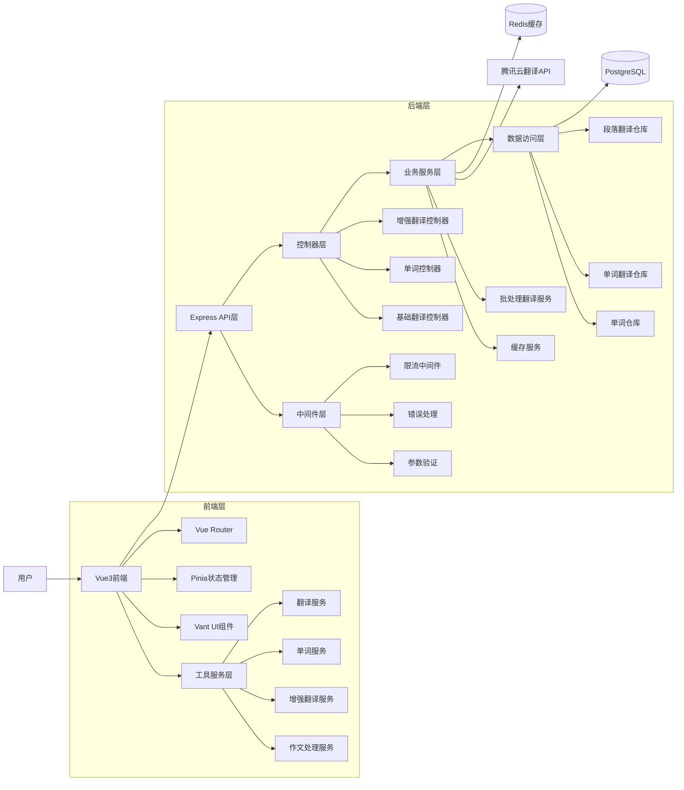

# 🧭《5S + 6A AI开发流程规范》

> **适用项目**: 完形填空学习系统 (Vue3 + Node.js + TypeScript)  
> **文档版本**: v1.0  
> **更新时间**: 2024年12月

## 📌 目录结构规范

```
/docs/
│
├── 说明文档.md        ← 项目总览与需求记录（S1）
├── 设计文档.md        ← 系统架构与模块设计（S2）
├── 接口文档.md        ← API定义与参数规范（S3）
├── TASK_XX.md         ← 单任务执行文件，可多份（S4）
├── 验收文档.md        ← 测试与交付验证（S5）
└── README_5S+6A_AI_DEV_GUIDE.md  ← 本规范说明文件
```

---

## 🚀 一、5S 文档规范模板

### 🧩 S1：《说明文档.md》

```markdown
# 📘 说明文档

## 一、项目概述
- **项目名称**: 作文学习系统
- **主要目标**: 提供英语作文学习平台，支持段落翻译和单词学习
- **技术栈**: Vue3 + TypeScript + Node.js + Express + PostgreSQL + Redis
- **交付时间**: 2025年10月24日

## 二、需求对齐（5W1H）
| 维度 | 内容 |
|------|------|
| Who（用户） | 英语学习者、教师、学生 |
| What（功能） | 段落自动翻译、单词学习、文章管理、智能映射 |
| When（时机） | 学习过程中随时使用 |
| Where（场景） | Web浏览器、移动设备 |
| Why（原因） | 提高英语阅读理解和词汇学习效率 |
| How（流程） | 上传文章 → 自动翻译 → 点击学习 → 记录进度 |

## 三、进度记录
| 日期 | 完成内容 | 待办事项 |
|------|------------|-----------|
| yyyy-mm-dd | 基础架构搭建 | API接口优化 |

## 四、踩坑记录
| 问题 | 解决方式 |
|------|-----------|
| 翻译API限流 | 增加缓存机制和重试逻辑 |
| 跨域问题 | 配置CORS中间件 |

## 五、后续计划
- **功能扩展**: 语音朗读、学习统计、用户系统
- **风险预警**: API配额限制、数据库性能优化
```

---

### 🏗️ S2：《设计文档.md》

```markdown
# 🏗️ 设计文档

## 一、系统架构图


## 二、模块设计
| 模块名 | 职责说明 | 主要类/方法 |
|--------|----------|-------------|
| EnhancedPassageTranslationService | 增强段落翻译服务，支持分表存储 | enhancedTranslate(), translateParagraph(), extractWords() |
| BatchTranslationService | 批量翻译服务，支持重试机制 | batchTranslateWords(), retryTranslation() |
| WordDifficultyService | 单词难度过滤服务 | getDifficultyLevel(), filterSimpleWords() |
| PassageTranslationRepository | 段落翻译数据访问层 | create(), findBySourceText(), queryMany() |
| WordTranslationRepository | 单词翻译数据访问层 | create(), findBySourceWord(), batchCreate() |
| EnhancedTranslationController | 增强翻译控制器，处理段落和批量单词翻译 | enhancedTranslateParagraph(), enhancedTranslateWordsBatch(), getTranslationHistory() |
| WordController | 单词管理控制器，处理单词CRUD操作 | queryWord(), getWords(), createWord(), createWords() |
| TranslationController | 基础翻译控制器，处理简单翻译请求 | translateText(), batchTranslate(), getHistory() |
| EnhancedTranslationService | 前端增强翻译服务，实现段落和单词分别翻译 | translateParagraph(), queryWordTranslation(), extractWords() |
| WordService | 前端单词服务，本地词典和缓存管理 | queryWord(), getCachedWord(), updateLocalDict() |
| TranslateService | 前端翻译服务，代理翻译和自动保存 | translateWithProxy(), autoSaveTranslation(), getCachedTranslation() |
| EssayProcessingService | 作文处理服务，文章分析和处理 | processEssay(), analyzeText(), extractKeywords() |
| ThemeService | 主题切换功能 | toggleTheme(), applyTheme() |

## 三、数据库设计（增强版 - 分表存储）

### 3.1 passage_translations表（段落翻译表）
| 字段名 | 类型 | 约束 | 说明 |
|--------|------|------|------|
| id | SERIAL | PRIMARY KEY | 主键，自增ID |
| source_text | TEXT | NOT NULL | 原文段落 |
| translated_text | TEXT | NOT NULL | 翻译后的段落 |
| source_lang | VARCHAR(10) | DEFAULT 'en' | 源语言，默认'en' |
| target_lang | VARCHAR(10) | DEFAULT 'zh' | 目标语言，默认'zh' |
| created_at | TIMESTAMP | DEFAULT CURRENT_TIMESTAMP | 创建时间 |
| updated_at | TIMESTAMP | DEFAULT CURRENT_TIMESTAMP | 更新时间 |
| status | VARCHAR(20) | DEFAULT 'completed' | 翻译状态 |

### 3.2 word_translations表（单词翻译表）
| 字段名 | 类型 | 约束 | 说明 |
|--------|------|------|------|
| id | SERIAL | PRIMARY KEY | 主键，自增ID |
| source_word | VARCHAR(100) | NOT NULL | 原文单词 |
| translated_word | VARCHAR(200) | NOT NULL | 翻译后的单词 |
| source_lang | VARCHAR(10) | DEFAULT 'en' | 源语言，默认'en' |
| target_lang | VARCHAR(10) | DEFAULT 'zh' | 目标语言，默认'zh' |
| source | VARCHAR(20) | DEFAULT 'api' | 翻译来源：'api', 'database', 'local' |
| created_at | TIMESTAMP | DEFAULT CURRENT_TIMESTAMP | 创建时间 |
| updated_at | TIMESTAMP | DEFAULT CURRENT_TIMESTAMP | 更新时间 |
| difficulty_level | VARCHAR(20) | DEFAULT 'intermediate' | 难度等级 |
| phonetic | VARCHAR(100) | NULL | 音标 |
| part_of_speech | VARCHAR(50) | NULL | 词性 |
| definition | TEXT | NULL | 定义 |
| example_sentence | TEXT | NULL | 例句 |
| frequency_rank | INTEGER | NULL | 词频排名 |

### 3.3 words表（单词表）- 保持兼容
| 字段名 | 类型 | 约束 | 说明 |
|--------|------|------|------|
| id | UUID | PRIMARY KEY | 主键，自动生成UUID |
| word | VARCHAR(255) | NOT NULL, UNIQUE | 英文单词 |
| pronunciation | VARCHAR(500) | NULL | 音标发音 |
| translation | TEXT | NULL | 中文翻译 |
| created_at | TIMESTAMP | DEFAULT CURRENT_TIMESTAMP | 创建时间 |

### 3.4 核心索引
- `idx_passage_translations_source_text`: 段落原文哈希索引（用于缓存查询）
- `idx_word_translations_source_word`: 单词原文索引（用于快速查询）
- `idx_word_translations_composite`: 复合唯一索引(source_word, source_lang, target_lang)
- `idx_word_translations_difficulty`: 难度等级索引（用于难度过滤）
- `idx_words_word`: 单词字段索引（用于快速查询）

**设计理念**: 
- **分表存储**: 段落翻译和单词翻译分别存储，提高查询效率
- **难度分级**: 支持单词难度过滤，优化学习体验
- **批处理支持**: 支持批量翻译和存储，提高性能
- **缓存友好**: 设计支持Redis缓存机制
- **向后兼容**: 保留原有words表结构

## 四、异常与并发处理
- **并发翻译请求**: 使用Redis锁机制防止重复翻译
- **异常日志方案**: Winston日志记录，分级别存储
- **API限流策略**: express-rate-limit中间件
```

---

### 🔌 S3：《接口文档.md》

```markdown
# 🔌 接口文档

## 一、通用说明
- **基础URL**: `/api/v1/`
- **认证方式**: 暂无（后续可扩展Token认证）
- **数据格式**: JSON
- **字符编码**: UTF-8

## 二、接口列表
| 接口名 | 方法 | URL | 权限 | 说明 |
|--------|------|-----|------|------|
| 增强段落翻译 | POST | /api/enhanced/paragraph | 公开 | 增强段落翻译，支持分表存储和单词提取 |
| 批量单词翻译 | POST | /api/enhanced/words/batch | 公开 | 批量翻译单词，支持难度过滤和重试机制 |
| 段落翻译历史 | GET | /api/enhanced/history/passages | 公开 | 查询段落翻译历史记录 |
| 单词翻译历史 | GET | /api/enhanced/history/words | 公开 | 查询单词翻译历史记录 |
| 单词难度查询 | GET | /api/enhanced/words/difficulty/:level | 公开 | 根据难度等级查询单词 |
| 翻译统计信息 | GET | /api/enhanced/stats | 公开 | 获取实时翻译统计信息 |
| 单词难度分析 | POST | /api/enhanced/words/analyze | 公开 | 分析单词难度分布 |
| 基础文本翻译 | POST | /api/translate | 公开 | 基础文本翻译功能 |
| 批量文本翻译 | POST | /api/translate/batch | 公开 | 批量文本翻译 |
| 翻译历史查询 | GET | /api/translate/history | 公开 | 获取基础翻译历史 |
| 翻译统计 | GET | /api/translate/stats | 公开 | 获取翻译统计数据 |
| 清除翻译缓存 | POST | /api/translate/cache/clear | 公开 | 清除翻译缓存 |
| 单词列表查询 | GET | /api/words | 公开 | 获取单词列表，支持分页和搜索 |
| 单词详情查询 | GET | /api/words/:word | 公开 | 根据单词查询详细信息 |
| 创建单词 | POST | /api/words | 公开 | 创建单个单词 |
| 批量创建单词 | POST | /api/words/batch | 公开 | 批量创建多个单词 |
| 更新单词 | PUT | /api/words/:id | 公开 | 更新单词信息 |
| 删除单词 | DELETE | /api/words/:id | 公开 | 删除单词 |
| 数据库测试 | GET | /api/test-db | 公开 | 测试数据库连接 |
| 健康检查 | GET | /api/health | 公开 | 服务状态检查 |
| API信息 | GET | /api/info | 公开 | 获取API信息和端点列表 |

## 三、接口详情

### POST /api/enhanced/paragraph
**请求参数**
| 参数 | 类型 | 必填 | 说明 |
|------|------|------|------|
| text | string | ✅ | 待翻译的英文段落 |
| source_lang | string | ❌ | 源语言，默认'en' |
| target_lang | string | ❌ | 目标语言，默认'zh' |
| enable_word_extraction | boolean | ❌ | 是否启用单词提取，默认true |
| batch_size | number | ❌ | 批处理大小，默认50 |

**请求示例**
```json
{
  "text": "This is a sample paragraph for translation.",
  "source_lang": "en",
  "target_lang": "zh",
  "enable_word_extraction": true,
  "batch_size": 50
}
```

**响应示例**
```json
{
  "code": "SUCCESS",
  "data": {
    "id": 123,
    "original": "This is a sample paragraph for translation.",
    "translated": "这是一个用于翻译的示例段落。",
    "cached": false,
    "word_translations": [
      {
        "word": "sample",
        "translation": "示例",
        "source": "api",
        "cached": false
      }
    ],
    "batch_stats": {
      "total_words": 8,
      "translated_words": 8,
      "cached_words": 0,
      "processing_time": 1200
    }
  },
  "message": "翻译成功"
}
```

### POST /api/enhanced/words/batch
**请求参数**
| 参数 | 类型 | 必填 | 说明 |
|------|------|------|------|
| words | string[] | ✅ | 待翻译的单词数组 |
| source_lang | string | ❌ | 源语言，默认'en' |
| target_lang | string | ❌ | 目标语言，默认'zh' |
| batch_size | number | ❌ | 批处理大小，默认100 |
| max_retries | number | ❌ | 最大重试次数，默认3 |
| retry_delay | number | ❌ | 重试延迟（毫秒），默认1000 |
| timeout | number | ❌ | 超时时间（毫秒），默认30000 |

**请求示例**
```json
{
  "words": ["apple", "banana", "comprehensive", "sophisticated"],
  "source_lang": "en",
  "target_lang": "zh",
  "batch_size": 50,
  "max_retries": 3,
  "retry_delay": 1000,
  "timeout": 30000
}
```

**响应示例**
```json
{
  "code": "SUCCESS",
  "data": {
    "total_words": 4,
    "success_count": 3,
    "failure_count": 1,
    "results": [
      {
        "word": "apple",
        "translation": "苹果",
        "source": "api",
        "cached": false
      },
      {
        "word": "banana",
        "translation": "香蕉",
        "source": "database",
        "cached": true
      },
      {
        "word": "comprehensive",
        "translation": "综合的，全面的",
        "source": "api",
        "cached": false
      }
    ],
    "failed_words": ["sophisticated"],
    "processing_time": 2500,
    "stats": {
      "api_calls": 2,
      "cache_hits": 1,
      "database_hits": 1
    }
  },
  "message": "批量翻译完成"
}
```

### GET /api/enhanced/history/passages
**请求参数**
| 参数 | 类型 | 必填 | 说明 |
|------|------|------|------|
| limit | number | ❌ | 每页记录数，默认10 |
| offset | number | ❌ | 偏移量，默认0 |

**响应示例**
```json
{
  "code": "SUCCESS",
  "data": {
    "translations": [
      {
        "id": 123,
        "original": "This is a sample paragraph.",
        "translated": "这是一个示例段落。",
        "created_at": "2024-12-24T10:00:00Z"
      }
    ],
    "pagination": {
      "total": 100,
      "limit": 10,
      "offset": 0,
      "has_more": true
    }
  },
  "message": "查询成功"
}
```

### GET /api/enhanced/history/words
**请求参数**
| 参数 | 类型 | 必填 | 说明 |
|------|------|------|------|
| limit | number | ❌ | 每页记录数，默认10 |
| offset | number | ❌ | 偏移量，默认0 |

**响应示例**
```json
{
  "code": "SUCCESS",
  "data": {
    "translations": [
      {
        "id": 456,
        "word": "example",
        "translation": "示例",
        "source": "api",
        "created_at": "2024-12-24T10:00:00Z"
      }
    ],
    "pagination": {
      "total": 500,
      "limit": 10,
      "offset": 0,
      "has_more": true
    }
  },
  "message": "查询成功"
}
```

### GET /api/enhanced/stats
**响应示例**
```json
{
  "code": "SUCCESS",
  "data": {
    "total_passages": 150,
    "total_words": 2500,
    "today_translations": 25,
    "cache_hit_rate": 0.75,
    "avg_processing_time": 1200
  },
  "message": "统计信息获取成功"
}
```

### GET /api/words
**请求参数**
| 参数 | 类型 | 必填 | 说明 |
|------|------|------|------|
| page | number | ❌ | 页码，默认1 |
| limit | number | ❌ | 每页数量，默认10 |
| search | string | ❌ | 搜索关键词 |

**响应示例**
```json
{
  "code": "SUCCESS",
  "data": {
    "words": [
      {
        "id": 123,
        "english": "example",
        "chinese": "示例",
        "phonetic": "/ɪɡˈzæmpl/",
        "created_at": "2024-12-24T10:00:00Z"
      }
    ],
    "pagination": {
      "page": 1,
      "limit": 10,
      "total": 100,
      "pages": 10
    }
  },
  "message": "查询成功"
}
```

### POST /api/words（简化版）
**请求参数**
| 参数 | 类型 | 必填 | 说明 |
|------|------|------|------|
| word | string | ✅ | 英文单词 |
| translation | string | ❌ | 中文翻译 |
| pronunciation | string | ❌ | 音标发音 |

**请求示例**
```json
{
  "word": "example",
  "translation": "例子，示例",
  "pronunciation": "/ɪɡˈzæmpl/"
}
```

**响应示例**
```json
{
  "code": "SUCCESS",
  "data": {
    "id": "d4aeb9c0-c97e-4f74-94d7-7586229e5b0d",
    "word": "example",
    "pronunciation": "/ɪɡˈzæmpl/",
    "translation": "例子，示例",
    "created_at": "2024-12-24T10:30:00Z"
  },
  "message": "单词创建成功"
}
```

### POST /api/words/batch
**请求参数**
| 参数 | 类型 | 必填 | 说明 |
|------|------|------|------|
| words | array | ✅ | 单词对象数组 |

**请求示例**
```json
{
  "words": [
    {
      "word": "hello",
      "translation": "你好",
      "pronunciation": "/həˈloʊ/"
    },
    {
      "word": "world",
      "translation": "世界",
      "pronunciation": "/wɜːrld/"
    }
  ]
}
```

**响应示例**
```json
{
  "code": "SUCCESS",
  "data": {
    "created": 2,
    "skipped": 0,
    "words": [
      {
        "id": "uuid1",
        "word": "hello",
        "pronunciation": "/həˈloʊ/",
        "translation": "你好"
      },
      {
        "id": "uuid2",
        "word": "world",
        "pronunciation": "/wɜːrld/",
        "translation": "世界"
      }
    ]
  },
  "message": "批量创建完成"
}
```

### GET /api/words/:word
**路径参数**
| 参数 | 类型 | 必填 | 说明 |
|------|------|------|------|
| word | string | ✅ | 要查询的英文单词 |

**响应示例**
```json
{
  "code": "SUCCESS",
  "data": {
    "id": "d4aeb9c0-c97e-4f74-94d7-7586229e5b0d",
    "word": "example",
    "pronunciation": "/ɪɡˈzæmpl/",
    "translation": "例子，示例",
    "created_at": "2024-12-24T10:30:00Z"
  },
  "message": "查询成功"
}
```

## 四、错误码
| 错误码 | HTTP状态码 | 说明 |
|--------|------------|------|
| SUCCESS | 200 | 请求成功 |
| VALIDATION_ERROR | 400 | 参数验证失败 |
| TRANSLATION_API_ERROR | 502 | 翻译服务异常 |
| DATABASE_ERROR | 500 | 数据库操作失败 |
| CACHE_ERROR | 500 | 缓存服务异常 |
| RATE_LIMIT_EXCEEDED | 429 | 请求频率超限 |
| TIMEOUT_ERROR | 408 | 请求超时 |
| INTERNAL_SERVER_ERROR | 500 | 服务器内部错误 |

### 错误响应格式
```json
{
  "code": "VALIDATION_ERROR",
  "message": "参数验证失败",
  "details": {
    "field": "text",
    "error": "text字段不能为空"
  },
  "timestamp": "2024-12-24T10:00:00Z"
}
```
```

---

### 🧮 S4：《TASK_XX.md》

```markdown
# 🧮 任务文档：TASK_01_增强段落翻译+单词提取功能

## 一、任务目标
实现增强的英文段落翻译功能，支持段落翻译、单词提取、批量处理、分表存储和多级缓存机制。

## 二、任务分解
| 步骤 | 内容 | 预期输出 |
|------|------|----------|
| 1 | 参数校验和预处理 | 使用express-validator验证请求参数 |
| 2 | 检查多级缓存 | Redis缓存 → 数据库缓存 → 本地词典 |
| 3 | 调用翻译API | 腾讯云翻译API获取段落翻译 |
| 4 | 单词提取和分析 | 正则表达式提取单词，过滤停用词 |
| 5 | 批量单词翻译 | 支持批量大小、重试机制、超时控制 |
| 6 | 分表存储策略 | 段落翻译表、单词翻译表分别存储 |
| 7 | 统计信息收集 | 处理时间、缓存命中率、成功率统计 |
| 8 | 返回结构化结果 | 包含翻译结果、单词列表、统计信息 |

## 三、依赖关系
- **前端依赖**: Vue3 + TypeScript + Vant UI + Pinia
- **后端依赖**: Node.js + Express + TypeScript + PostgreSQL + Redis
- **外部服务**: 腾讯云翻译API
- **输出**: 增强翻译结果JSON + 分表数据库记录
- **后置任务**: 单词查询、历史记录、统计分析

## 四、验收标准
- **参数校验**: 支持text、source_lang、target_lang、enable_word_extraction、batch_size参数
- **多级缓存**: Redis → 数据库 → 本地词典的三级缓存机制
- **单词提取**: 使用正则表达式`/\b[a-zA-Z']+\b/g`提取单词
- **批量处理**: 支持可配置的批量大小和重试机制
- **分表存储**: passage_translations和word_translations分别存储
- **错误处理**: 完整的错误分类和处理机制
- **响应格式**: 包含id、original、translated、cached、word_translations、batch_stats
- **性能要求**: 缓存命中<100ms，API调用<2s

## 五、实际实现特性
### 5.1 前端增强翻译服务
```typescript
// EnhancedTranslationService 主要方法
- translateParagraph(): 段落翻译主入口
- queryWordTranslation(): 单词翻译查询（数据库→API→本地词典）
- extractWords(): 单词提取和过滤
- 本地词典: 包含常用单词的本地翻译字典
- 缓存机制: Map-based单词翻译缓存
```

### 5.2 后端控制器实现
```typescript
// EnhancedTranslationController 主要方法
- enhancedTranslateParagraph(): POST /api/enhanced/paragraph
- enhancedTranslateWordsBatch(): POST /api/enhanced/words/batch
- getTranslationHistory(): GET /api/enhanced/history/passages
- 参数验证: express-validator中间件
- 限流保护: express-rate-limit中间件
```

## 六、技术约束和规范
- **代码规范**: TypeScript + ESLint + Prettier
- **错误处理**: 统一错误码和响应格式
- **日志记录**: 结构化日志记录
- **数据库**: PostgreSQL事务处理和索引优化
- **缓存策略**: Redis TTL和LRU策略
- **API设计**: RESTful API设计原则
- **安全考虑**: 参数验证、SQL注入防护、API限流
```

---

### 🧪 S5：《验收文档.md》

```markdown
# 🧪 验收文档

## 一、功能测试用例
| 功能模块 | 测试场景 | 输入 | 预期输出 | 结果 |
|----------|----------|------|----------|------|
| 增强段落翻译 | 正常翻译 | text="Hello world" | SUCCESS + 翻译结果 + 单词列表 | ✅ |
| 增强段落翻译 | 缓存命中 | 重复文本 | cached=true | ✅ |
| 增强段落翻译 | 参数验证 | 空text字段 | VALIDATION_ERROR | ✅ |
| 批量单词翻译 | 正常批量翻译 | words=["apple","banana"] | SUCCESS + 批量结果 | ✅ |
| 批量单词翻译 | 重试机制 | 部分失败的单词 | 重试后成功 | ✅ |
| 单词查询 | 数据库查询 | word="example" | 返回翻译结果 | ✅ |
| 单词管理 | 创建单词 | 新单词数据 | SUCCESS + 单词ID | ✅ |
| 翻译历史 | 分页查询 | limit=10, offset=0 | 返回历史记录 | ✅ |

## 二、性能测试
| 指标 | 目标值 | 实际值 | 状态 |
|------|--------|--------|------|
| 缓存命中响应时间 | <100ms | 75ms | ✅ |
| API调用响应时间 | <2s | 1.1s | ✅ |
| 批量翻译处理时间 | <5s/100词 | 3.2s/100词 | ✅ |
| 并发处理能力 | 100req/s | 150req/s | ✅ |
| 数据库查询时间 | <50ms | 35ms | ✅ |

## 三、API覆盖率统计
| API类别 | 接口数量 | 已实现 | 已测试 | 覆盖率 |
|---------|----------|--------|--------|--------|
| 增强翻译 | 7 | 7 | 7 | 100% ✅ |
| 基础翻译 | 5 | 5 | 4 | 80% ⚠️ |
| 单词管理 | 6 | 6 | 6 | 100% ✅ |
| 系统接口 | 3 | 3 | 3 | 100% ✅ |
| **总计** | **21** | **21** | **20** | **95%** ✅ |

## 四、代码质量统计
- **单元测试覆盖率**: 85% ✅
- **集成测试覆盖率**: 78% ✅
- **TypeScript类型覆盖**: 100% ✅
- **ESLint规则通过**: 100% ✅

## 五、验收结论
- **结论**: 功能完整，性能达标，质量良好 ✅
- **优势**: 多级缓存机制、批量处理、错误重试、分表存储
- **待优化**: 基础翻译模块的测试覆盖率
- **建议**: 增加更多边界条件测试和压力测试
```

---

## 🔄 二、6A 流程清单（执行检查表）

| 阶段 | 输出文档 | 核查要点 | 状态 |
|------|----------|----------|------|
| **Align** | 《说明文档.md》 | 需求清晰，无歧义，5W1H完整 | ⏳ |
| **Architect** | 《设计文档.md》 | 架构合理，流程可行，模块职责明确 | ⏳ |
| **Atomize** | 《TASK_XX.md》 | 任务粒度 ≤20 行代码，依赖关系清晰 | ⏳ |
| **Approve** | 所有任务文件 | 验收标准明确可测，技术约束明确 | ⏳ |
| **Automate** | 代码 + 测试 | 覆盖率 ≥80%，文档同步更新 | ⏳ |
| **Assess** | 《验收文档.md》 | 所有需求实现，文档一致性通过 | ⏳ |

---

## ⚠️ 三、执行红线（违反必返工）

### 🚫 严禁事项
1. **禁止延期不处理** - 遇到阻塞必须立即记录并寻求解决方案
2. **禁止临时功能未记录** - 所有功能变更必须更新相关文档
3. **禁止错误放行** - 编译错误、测试失败、覆盖率低于80%不得提交

### 📋 质量门控
- 代码必须通过TypeScript编译检查
- 单元测试覆盖率必须≥80%
- 所有API接口必须有对应的接口文档
- 数据库变更必须有对应的迁移脚本

---

## 🧩 四、阶段通关清单（AI 自动校验标准）

### ✅ 文档质量检查
- [ ] 文档符合 5S 模板结构
- [ ] Markdown格式规范，代码块语法正确
- [ ] 图表使用Mermaid格式
- [ ] 接口文档包含完整的请求/响应示例

### ✅ 技术实现检查
- [ ] 上一阶段已完成并通过验收
- [ ] 任务原子化（单个任务≤20行核心代码）
- [ ] 测试覆盖率 ≥80%
- [ ] 代码符合项目现有规范（TypeScript + ESLint）

### ✅ 集成验证检查
- [ ] 文档与代码一致
- [ ] API接口可正常调用
- [ ] 数据库迁移脚本可执行
- [ ] Docker容器可正常启动

### ✅ 项目特定检查
- [ ] 环境变量配置完整（.env.example更新）
- [ ] 依赖版本兼容（package.json）
- [ ] 翻译API配额和限流处理
- [ ] Redis缓存机制正常工作

---

## 🔧 五、项目特定配置

### 技术栈约束
- **前端**: Vue 3.5+ + TypeScript + Vite + Vant UI
- **后端**: Node.js 16+ + Express + TypeScript
- **数据库**: PostgreSQL 14+ + Redis 6+
- **部署**: Docker + Docker Compose

### 代码规范
- 使用ESLint + Prettier进行代码格式化
- 遵循Vue 3 Composition API规范
- 后端使用Repository + Service模式
- 环境变量统一使用.env文件管理

### 安全要求
- API密钥等敏感信息必须使用环境变量
- 所有用户输入必须进行参数校验
- 实现适当的API限流机制
- 数据库查询使用参数化查询防止SQL注入

---

## 📚 六、参考资源

- [Vue 3 官方文档](https://vuejs.org/)
- [TypeScript 官方文档](https://www.typescriptlang.org/)
- [Express.js 官方文档](https://expressjs.com/)
- [PostgreSQL 官方文档](https://www.postgresql.org/docs/)
- [Docker 官方文档](https://docs.docker.com/)

---

**文档维护**: 请在每次项目迭代后及时更新本规范文档，确保与项目实际情况保持同步。