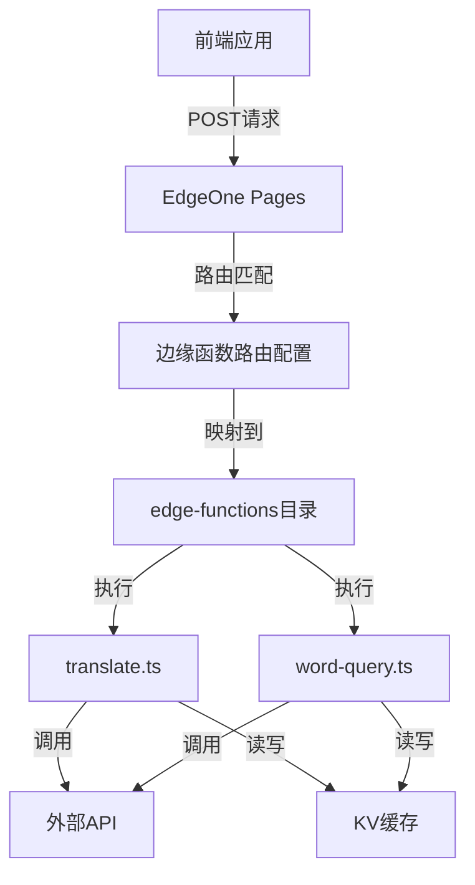
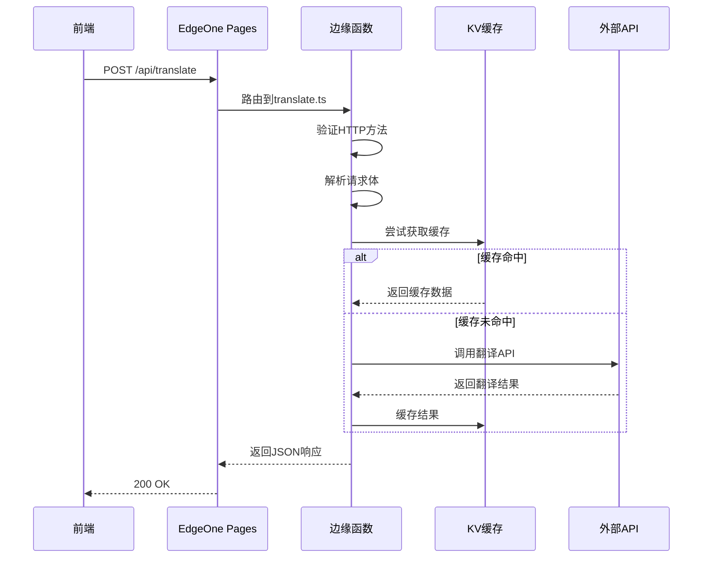

# API 405错误问题解决方案设计文档

## 整体架构图



## 分层设计和核心组件

### 1. 路由配置层
- **功能**：负责将API请求路由到对应的边缘函数
- **配置文件**：edgeone.json
- **核心配置**：functions.routes数组，定义路径到函数的映射

### 2. 函数处理层
- **功能**：接收HTTP请求，处理业务逻辑，返回响应
- **入口函数**：onRequest(context)，接收请求上下文
- **处理逻辑**：
  - HTTP方法验证
  - 请求体解析
  - 参数验证
  - 业务逻辑处理
  - 缓存读写
  - 响应生成

### 3. API集成层
- **功能**：与外部API通信
- **外部服务**：火山AI API、百度翻译API
- **通信方式**：axios HTTP客户端

### 4. 缓存层
- **功能**：缓存API响应结果
- **技术**：Vercel KV
- **过期策略**：30天

## 接口契约定义

### 1. /api/translate 接口

**请求**：
- 方法：POST
- 内容类型：application/json
- 请求体：
  ```json
  {
    "text": "要翻译的文本",
    "from": "源语言代码，默认为auto",
    "to": "目标语言代码，默认为zh",
    "useBaidu": true,
    "skipCache": false
  }
  ```

**响应**：
- 成功：
  ```json
  {
    "translatedText": "翻译后的文本",
    "from": "源语言",
    "to": "目标语言",
    "provider": "翻译服务提供商",
    "fromCache": false
  }
  ```
- 失败：
  ```json
  {
    "error": "错误信息",
    "message": "详细错误描述"
  }
  ```

### 2. /api/word-query 接口

**请求**：
- 方法：POST
- 内容类型：application/json
- 请求体：
  ```json
  {
    "word": "要查询的单词",
    "contextSentence": "上下文句子（可选）",
    "useBaidu": true,
    "skipCache": false
  }
  ```

**响应**：
- 成功：
  ```json
  {
    "phonetic": "音标",
    "definitions": ["释义1", "释义2"],
    "examples": ["例句1", "例句2"],
    "provider": "查询服务提供商",
    "fromCache": false
  }
  ```
- 失败：
  ```json
  {
    "error": "错误信息",
    "message": "详细错误描述"
  }
  ```

## 数据流向图



## 异常处理策略

### 1. HTTP方法错误（405）
- 当请求方法不是POST或OPTIONS时返回405错误
- 响应体包含错误信息
- 设置正确的CORS头

### 2. 请求参数错误（400）
- 当必需参数缺失或格式错误时返回400错误
- 提供详细的错误描述

### 3. 服务器内部错误（500）
- 捕获所有异常，返回500错误
- 记录详细错误日志
- 返回用户友好的错误信息

### 4. CORS处理
- 处理OPTIONS预检请求，返回204状态码
- 设置允许的源、方法和头部

## 405错误解决方案设计

### 问题根因分析

通过代码检查，发现以下关键问题导致405错误：

1. **路由配置错误**：在edgeone.json中，路由配置使用了错误的字段名`pattern`，而EdgeOne Pages正确的字段名应为`path`
2. **函数路径不完整**：function字段缺少完整路径前缀"edge-functions/"
3. **环境变量缺失**：缺少腾讯API相关的环境变量配置

### 具体修复方案

#### 1. 修复路由配置

将edgeone.json中的路由配置从`pattern`改为`path`，并添加完整的函数路径：

```json
"routes": [
  {
    "path": "/api/translate",
    "function": "edge-functions/translate.ts"
  },
  {
    "path": "/api/word-query",
    "function": "edge-functions/word-query.ts"
  }
]
```

#### 2. 添加缺失的环境变量

在environment配置中添加腾讯API相关的环境变量：

```json
"TENCENT_APP_ID": "${TENCENT_APP_ID}",
"TENCENT_APP_KEY": "${TENCENT_APP_KEY}",
"TENCENT_DICT_URL": "${TENCENT_DICT_URL}"
```

#### 3. 部署与验证步骤

1. 更新edgeone.json配置
2. 提交并推送代码到GitHub仓库
3. 在EdgeOne Pages控制台重新部署项目
4. 验证单词查询API是否正常响应POST请求

### 异常处理策略增强

即使修复后，仍保留多级备用方案：
1. 优先使用腾讯词典API
2. 失败后尝试百度翻译API
3. 最后尝试火山AI API

这样可以确保在任何API出现问题时，系统仍能提供服务。