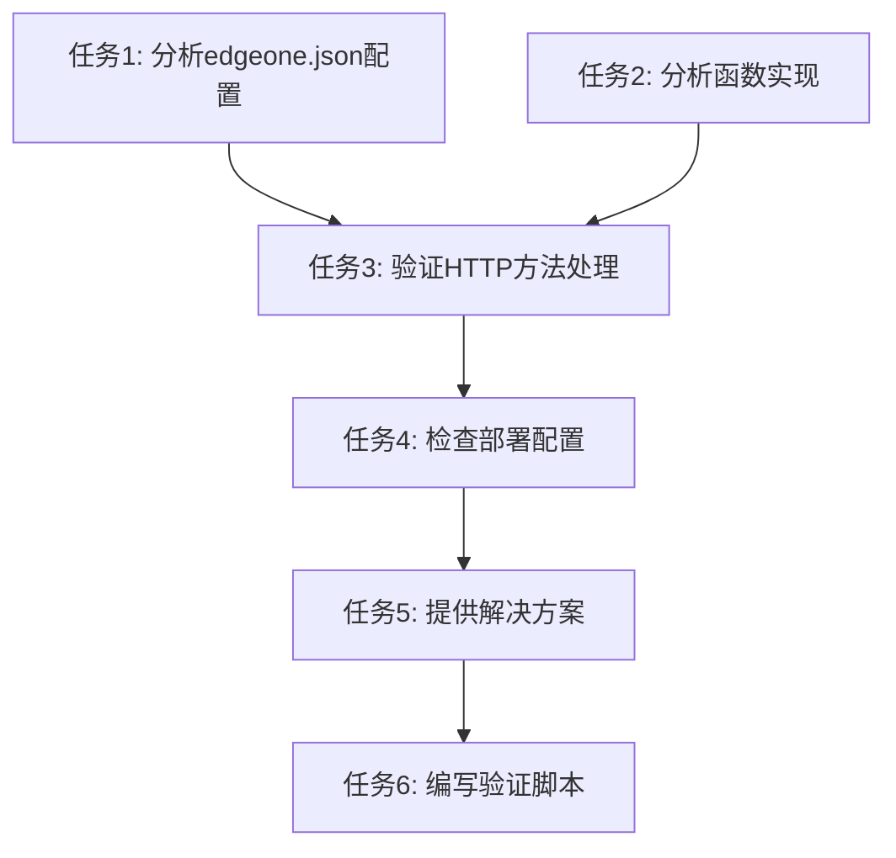

# API 405错误问题解决方案任务拆分

## 任务依赖图

## 子任务详情

### 任务1: 分析edgeone.json配置

**输入契约**：
- 前置依赖：无
- 输入数据：edgeone.json文件
- 环境依赖：无

**输出契约**：
- 输出数据：配置分析报告
- 交付物：配置问题清单
- 验收标准：确认functions.routes配置是否正确映射API路径

**实现约束**：
- 技术栈：无
- 接口规范：遵循EdgeOne Pages配置规范
- 质量要求：详细记录每个配置项的正确性

**依赖关系**：
- 后置任务：任务3
- 并行任务：任务2

### 任务2: 分析函数实现

**输入契约**：
- 前置依赖：无
- 输入数据：translate.ts和word-query.ts文件
- 环境依赖：无

**输出契约**：
- 输出数据：函数实现分析报告
- 交付物：代码问题清单
- 验收标准：确认onRequest函数是否正确处理HTTP方法

**实现约束**：
- 技术栈：TypeScript
- 接口规范：遵循EdgeOne Pages函数规范
- 质量要求：详细记录每个潜在问题

**依赖关系**：
- 后置任务：任务3
- 并行任务：任务1

### 任务3: 验证HTTP方法处理

**输入契约**：
- 前置依赖：任务1和任务2
- 输入数据：配置分析和函数实现分析结果
- 环境依赖：无

**输出契约**：
- 输出数据：HTTP方法处理验证报告
- 交付物：问题确认清单
- 验收标准：确认405错误的具体原因

**实现约束**：
- 技术栈：无
- 接口规范：无
- 质量要求：提供明确的问题确认

**依赖关系**：
- 后置任务：任务4

### 任务4: 检查部署配置

**输入契约**：
- 前置依赖：任务3
- 输入数据：HTTP方法处理验证结果
- 环境依赖：EdgeOne Pages控制台访问（模拟）

**输出契约**：
- 输出数据：部署配置检查报告
- 交付物：部署问题清单
- 验收标准：确认函数部署状态和环境变量配置

**实现约束**：
- 技术栈：无
- 接口规范：无
- 质量要求：提供部署检查建议

**依赖关系**：
- 后置任务：任务5

### 任务5: 提供解决方案

**输入契约**：
- 前置依赖：任务4
- 输入数据：所有分析结果
- 环境依赖：无

**输出契约**：
- 输出数据：修复方案文档
- 交付物：具体的代码和配置修改建议
- 验收标准：提供可执行的修复步骤

**实现约束**：
- 技术栈：无
- 接口规范：无
- 质量要求：方案详细且可操作

**依赖关系**：
- 后置任务：任务6

### 任务6: 编写验证脚本

**输入契约**：
- 前置依赖：任务5
- 输入数据：修复方案
- 环境依赖：Node.js环境

**输出契约**：
- 输出数据：验证脚本
- 交付物：验证API是否正常工作的脚本
- 验收标准：脚本能够验证API端点是否正确响应POST请求

**实现约束**：
- 技术栈：JavaScript/TypeScript
- 接口规范：遵循测试脚本最佳实践
- 质量要求：脚本能够模拟前端请求并验证响应

**依赖关系**：
- 后置任务：无
- 并行任务：无