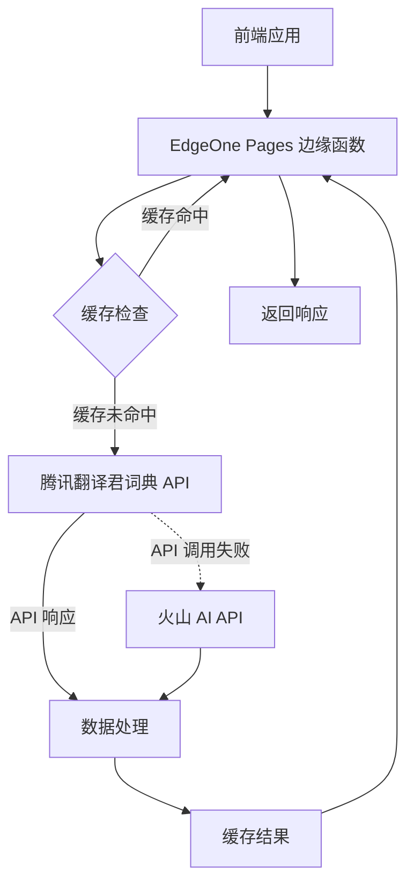
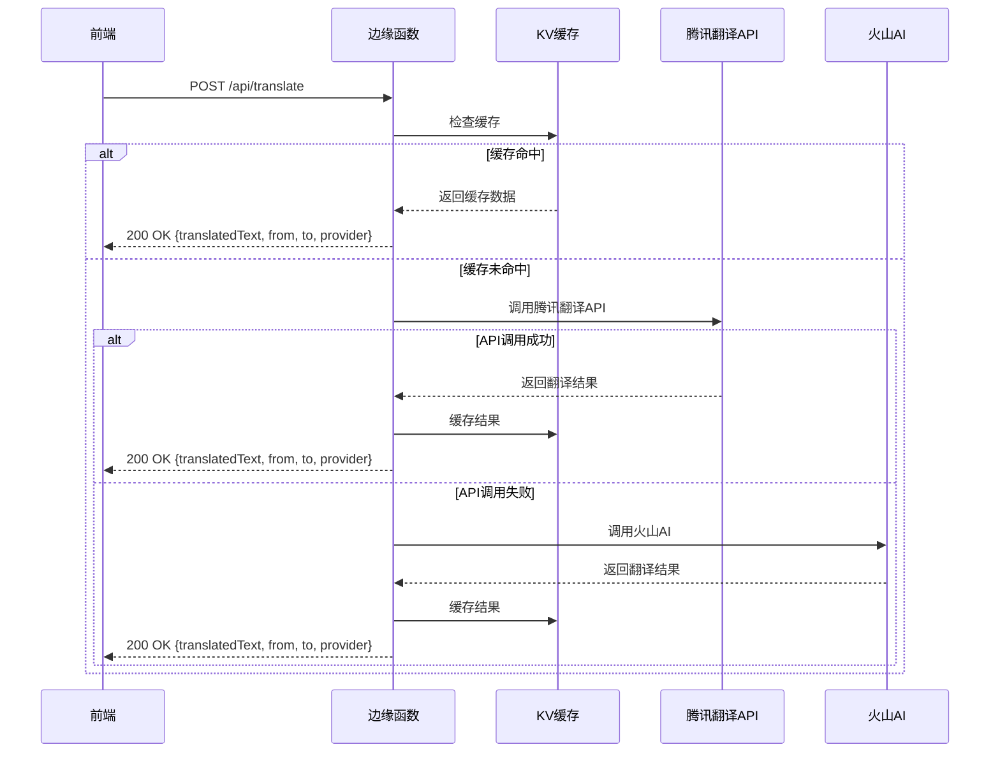
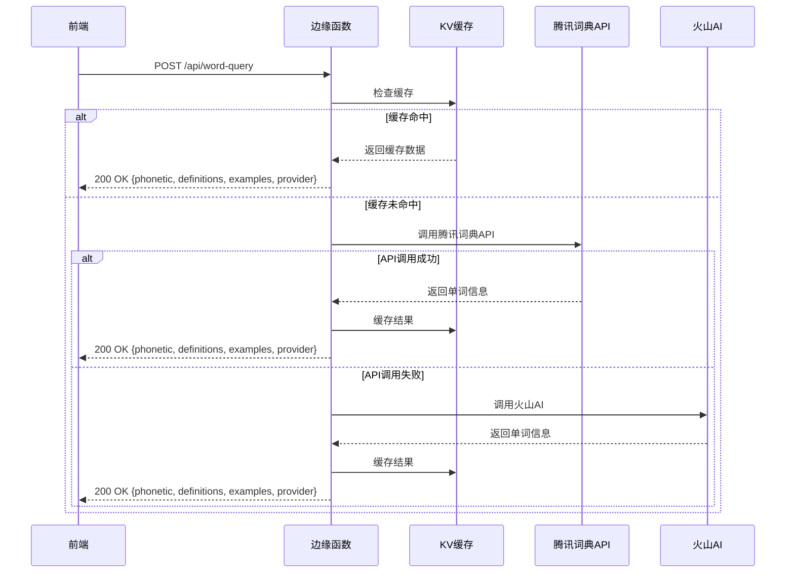

# 任务设计文档：将百度翻译改为腾讯翻译君词典 API

## 1. 整体架构图



## 2. 分层设计

### 2.1 路由配置层
- EdgeOne Pages 配置文件（edgeone.json）定义路由映射
- `/api/translate` 映射到 translate.ts
- `/api/word-query` 映射到 word-query.ts

### 2.2 函数处理层
- 入口函数：处理HTTP请求，参数验证，错误处理
- 缓存管理：KV存储，缓存键生成，缓存读写
- API调用：腾讯翻译君API调用函数
- 备用方案：火山AI API调用

### 2.3 API集成层
- 腾讯翻译君API调用函数：
  - 签名生成
  - 请求参数构建
  - 响应解析
  - 错误处理

### 2.4 缓存层
- 使用@vercel/kv进行缓存
- 缓存30天
- 缓存键生成基于请求参数

## 3. 接口契约定义

### 3.1 翻译API接口

#### 3.1.1 请求格式
```json
{
  "text": "待翻译文本",
  "from": "auto",  // 源语言，默认auto
  "to": "zh",     // 目标语言，默认zh
  "useBaidu": true, // 将更改为useTencent
  "skipCache": false
}
```

#### 3.1.2 响应格式
```json
{
  "translatedText": "翻译结果",
  "from": "en",    // 检测出的源语言
  "to": "zh",      // 目标语言
  "provider": "tencent", // API提供商
  "fromCache": false
}
```

### 3.2 单词查询API接口

#### 3.2.1 请求格式
```json
{
  "word": "待查询单词",
  "contextSentence": "上下文句子（可选）",
  "useBaidu": true, // 将更改为useTencent
  "skipCache": false
}
```

#### 3.2.2 响应格式
```json
{
  "phonetic": "音标",
  "definitions": ["释义1", "释义2"],
  "examples": ["例句1", "例句2"],
  "provider": "tencent",
  "fromCache": false
}
```

## 4. 数据流向图

### 4.1 翻译流程


### 4.2 单词查询流程


## 5. 异常处理策略

### 5.1 API调用异常
- 记录详细错误信息
- 回退到火山AI备用方案
- 给客户端返回友好错误信息

### 5.2 参数验证异常
- 验证请求参数格式和内容
- 返回400 Bad Request错误
- 提供明确的错误说明

### 5.3 环境配置异常
- 检查必要的环境变量
- 记录缺失配置信息
- 回退到备用方案或返回错误

### 5.4 CORS处理
- 保持现有CORS头设置
- 支持OPTIONS预检请求
- 允许跨域访问