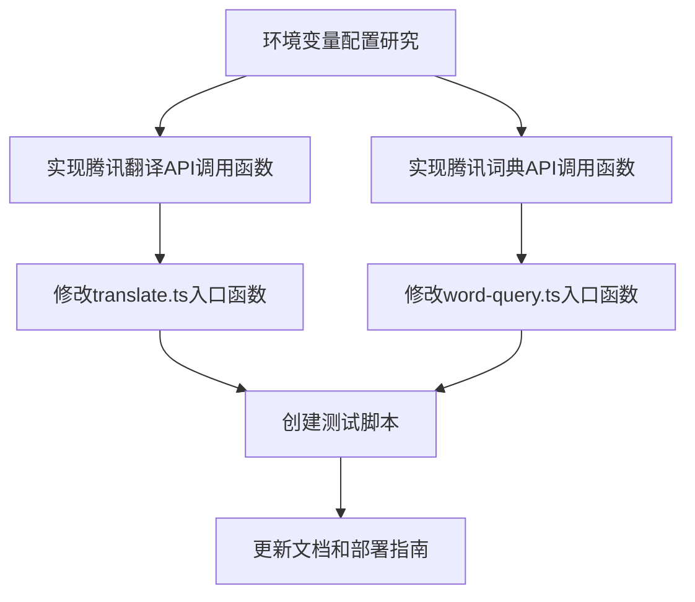

# 任务拆分文档：将百度翻译改为腾讯翻译君词典 API

## 1. 任务依赖图

## 2. 原子任务详情

### 2.1 环境变量配置研究

#### 2.1.1 输入契约
- 腾讯翻译君API文档
- 现有项目环境变量配置

#### 2.1.2 输出契约
- 定义所需的环境变量清单
- 记录环境变量的获取方式和配置步骤

#### 2.1.3 实现约束
- 保持与现有环境变量管理方式一致
- 确保API密钥安全存储

#### 2.1.4 依赖关系
- 前置任务：无
- 后置任务：实现腾讯翻译API调用函数，实现腾讯词典API调用函数

### 2.2 实现腾讯翻译API调用函数

#### 2.2.1 输入契约
- 环境变量配置研究结果
- 腾讯翻译API文档
- 现有`callBaiduTranslateAPI`函数实现

#### 2.2.2 输出契约
- 新增`callTencentTranslateAPI`函数
- 函数能够正确调用腾讯翻译API并返回预期格式的结果

#### 2.2.3 实现约束
- 使用axios进行HTTP请求
- 正确实现腾讯API的签名机制
- 处理各种响应状态和错误情况
- 函数签名与百度翻译API调用函数保持兼容

#### 2.2.4 依赖关系
- 前置任务：环境变量配置研究
- 后置任务：修改translate.ts入口函数

### 2.3 实现腾讯词典API调用函数

#### 2.3.1 输入契约
- 环境变量配置研究结果
- 腾讯词典API文档
- 现有`callBaiduTranslateAPI`函数实现

#### 2.3.2 输出契约
- 新增`callTencentDictAPI`函数
- 函数能够正确调用腾讯词典API并返回预期格式的结果

#### 2.3.3 实现约束
- 使用axios进行HTTP请求
- 正确实现腾讯API的签名机制
- 处理各种响应状态和错误情况
- 函数签名与百度翻译API调用函数保持兼容

#### 2.3.4 依赖关系
- 前置任务：环境变量配置研究
- 后置任务：修改word-query.ts入口函数

### 2.4 修改translate.ts入口函数

#### 2.4.1 输入契约
- 实现腾讯翻译API调用函数结果
- 现有translate.ts文件

#### 2.4.2 输出契约
- 修改后的translate.ts文件
- 支持调用腾讯翻译API并返回正确格式的响应
- 保留备用方案和缓存机制

#### 2.4.3 实现约束
- 保持现有的请求参数和响应格式
- 替换百度API调用逻辑，使用腾讯API
- 更新相关变量名和注释

#### 2.4.4 依赖关系
- 前置任务：实现腾讯翻译API调用函数
- 后置任务：创建测试脚本

### 2.5 修改word-query.ts入口函数

#### 2.5.1 输入契约
- 实现腾讯词典API调用函数结果
- 现有word-query.ts文件

#### 2.5.2 输出契约
- 修改后的word-query.ts文件
- 支持调用腾讯词典API并返回正确格式的响应
- 保留备用方案和缓存机制

#### 2.5.3 实现约束
- 保持现有的请求参数和响应格式
- 替换百度API调用逻辑，使用腾讯API
- 更新相关变量名和注释

#### 2.5.4 依赖关系
- 前置任务：实现腾讯词典API调用函数
- 后置任务：创建测试脚本

### 2.6 创建测试脚本

#### 2.6.1 输入契约
- 修改后的translate.ts和word-query.ts文件

#### 2.6.2 输出契约
- 测试脚本文件
- 能够验证API调用功能是否正常
- 测试各种边界情况和错误情况

#### 2.6.3 实现约束
- 脚本应该能够独立运行
- 提供清晰的测试结果输出
- 测试成功和失败的情况

#### 2.6.4 依赖关系
- 前置任务：修改translate.ts入口函数，修改word-query.ts入口函数
- 后置任务：更新文档和部署指南

### 2.7 更新文档和部署指南

#### 2.7.1 输入契约
- 所有实现结果
- 现有部署指南

#### 2.7.2 输出契约
- 更新的部署指南
- 包含腾讯翻译君API的配置说明
- 包含环境变量设置指南

#### 2.7.3 实现约束
- 文档内容清晰易懂
- 包含必要的配置步骤和示例
- 提供故障排除指南

#### 2.7.4 依赖关系
- 前置任务：创建测试脚本
- 后置任务：无