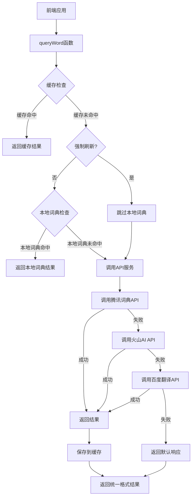

# 翻译服务实现设计文档

## 整体架构图



## 分层设计

### 1. 接口层
- **queryWord函数**：对外提供的主要接口，处理缓存、本地词典和API调用逻辑
- **参数**：
  - `word`: 查询的单词
  - `contextSentence`: 可选的上下文句子（当前版本未使用）
  - `forceRefresh`: 是否强制刷新缓存
- **返回值**：符合WordInfo接口的单词信息对象

### 2. API调用层
- **callTencentDictAPI函数**：直接调用腾讯词典API
- **callVolcanoAPI函数**：直接调用火山AI API
- **callBaiduTranslateAPI函数**：直接调用百度翻译API
- **职责**：
  - 生成API请求参数和签名
  - 发送HTTP请求
  - 处理响应和错误
  - 返回原始API结果

### 3. 响应处理层
- **normalizeTranslationResponse函数**：统一处理不同API的响应格式
- **职责**：
  - 确保返回的对象符合WordInfo接口
  - 处理空值和异常情况
  - 标准化音标、释义和例句的格式

### 4. 缓存层
- **wordCache**：Map对象，存储单词查询结果
- **localDictionary**：预设的常用单词词典
- **职责**：
  - 缓存API调用结果（7天有效期）
  - 提供快速的本地词典查询
  - 减少不必要的API调用

## 核心组件

### WordInfo接口
```typescript
interface WordInfo {
  phonetic: string;     // 音标
  definitions: string[]; // 释义数组
  examples?: string[];   // 例句数组（可选）
}
```

### 环境变量配置
| 环境变量 | 描述 | 默认值 | 必需 |
|---------|------|--------|------|
| VITE_TENCENT_APP_ID | 腾讯AI开放平台App ID | 空字符串 | 否（但无值时将跳过腾讯API） |
| VITE_TENCENT_KEY | 腾讯AI开放平台密钥 | 空字符串 | 否（但无值时将跳过腾讯API） |
| VITE_VOLCANO_API_KEY | 火山AI API密钥 | 空字符串 | 否（但无值时将跳过火山API） |
| VITE_BAIDU_APP_ID | 百度翻译API App ID | 空字符串 | 否（但无值时将跳过百度API） |
| VITE_BAIDU_SECRET_KEY | 百度翻译API密钥 | 空字符串 | 否（但无值时将跳过百度API） |

## 接口契约定义

### queryWord函数
```typescript
function queryWord(
  word: string, 
  contextSentence?: string | boolean, 
  forceRefresh: boolean = false
): Promise<WordInfo>
```

**输入**：
- `word`: 要查询的单词（必填）
- `contextSentence`: 上下文句子（可选，当前版本未使用）或forceRefresh标志
- `forceRefresh`: 是否强制刷新缓存（可选，默认false）

**输出**：
- 返回Promise<WordInfo>，包含单词的音标、释义和例句

### callTencentDictAPI函数
```typescript
function callTencentDictAPI(word: string): Promise<WordInfo>
```

**输入**：
- `word`: 要查询的单词（必填）

**输出**：
- 返回Promise<WordInfo>，包含腾讯词典API返回的单词信息

### callVolcanoAPI函数
```typescript
function callVolcanoAPI(word: string): Promise<WordInfo>
```

**输入**：
- `word`: 要查询的单词（必填）

**输出**：
- 返回Promise<WordInfo>，包含火山AI API返回的单词信息

### callBaiduTranslateAPI函数
```typescript
function callBaiduTranslateAPI(word: string): Promise<WordInfo>
```

**输入**：
- `word`: 要查询的单词（必填）

**输出**：
- 返回Promise<WordInfo>，包含百度翻译API返回的单词信息

### normalizeTranslationResponse函数
```typescript
function normalizeTranslationResponse(response: WordInfo): WordInfo
```

**输入**：
- `response`: 原始API响应对象

**输出**：
- 返回标准化后的WordInfo对象，确保符合接口定义

## 数据流向

1. **请求发起**：前端调用`queryWord`函数查询单词
2. **缓存检查**：检查是否有缓存的查询结果
3. **本地词典检查**：检查是否在本地词典中有该单词
4. **API调用**：按顺序调用腾讯→火山→百度API
5. **响应处理**：对API返回结果进行标准化处理
6. **缓存更新**：将结果保存到缓存中
7. **结果返回**：返回标准化的单词信息

## 异常处理策略

1. **API密钥缺失**：检查环境变量，若无对应API密钥则跳过该API
2. **请求超时**：每个API调用设置3秒超时，超时后尝试下一个API
3. **API调用失败**：捕获错误并记录日志，然后尝试下一个API
4. **响应格式错误**：检查响应结构，若不符合预期则抛出异常
5. **所有API失败**：返回友好的错误信息，确保前端不会崩溃

## 性能优化

1. **缓存机制**：使用Map对象缓存查询结果，减少API调用
2. **本地词典**：为常用单词提供本地词典，避免不必要的API调用
3. **超时控制**：设置合理的超时时间，避免长时间等待
4. **错误处理**：快速失败并尝试备用方案，提高响应速度

通过以上设计，可以实现高效、可靠的单词查询功能，同时确保不同翻译服务返回的结果格式一致，满足用户不使用边缘函数且确保翻译一致性的需求。