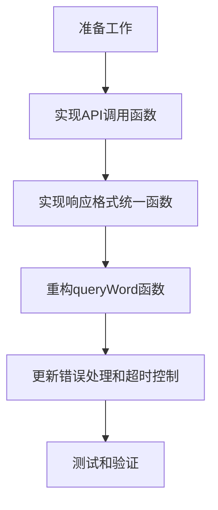

# 翻译服务实现任务分解

## 任务依赖图

## 任务列表

### 任务1: 准备工作

**输入契约**：
- 现有`src/utils/api.ts`文件
- `.env`文件配置

**输出契约**：
- 更新的文件包含必要的导入语句
- 环境变量配置

**实现约束**：
- 使用TypeScript
- 遵循现有代码风格

### 任务2: 实现API调用函数

**输入契约**：
- 导入的crypto模块
- 环境变量配置
- 待查询的单词

**输出契约**：
- `callTencentDictAPI`函数实现
- `callVolcanoAPI`函数实现
- `callBaiduTranslateAPI`函数实现

**实现约束**：
- 每个API调用设置3秒超时
- 使用axios发送HTTP请求
- 实现签名生成逻辑
- 处理API响应

### 任务3: 实现响应格式统一函数

**输入契约**：
- 各API返回的原始响应
- `WordInfo`接口定义

**输出契约**：
- `normalizeTranslationResponse`函数实现
- 确保返回符合`WordInfo`接口的对象

**实现约束**：
- 处理空值和异常情况
- 标准化音标、释义和例句格式

### 任务4: 重构queryWord函数

**输入契约**：
- 实现的API调用函数
- 实现的响应格式统一函数
- 现有的缓存和本地词典逻辑

**输出契约**：
- 更新的`queryWord`函数，移除对边缘函数的依赖
- 按腾讯→火山→百度顺序调用API

**实现约束**：
- 保持现有接口不变
- 维持缓存和本地词典功能

### 任务5: 更新错误处理和超时控制

**输入契约**：
- 重构后的`queryWord`函数
- 实现的API调用函数

**输出契约**：
- 完善的错误处理逻辑
- 适当的超时设置
- 详细的错误日志记录

**实现约束**：
- 每个API调用设置3秒超时
- 捕获并处理所有可能的异常
- 实现服务降级机制

### 任务6: 测试和验证

**输入契约**：
- 完整实现的翻译服务代码
- 配置了API密钥的`.env`文件

**输出契约**：
- 验证不同API的调用情况
- 确保响应格式一致性
- 验证错误处理机制

**实现约束**：
- 测试各种边界情况
- 测试无网络环境
- 测试API密钥缺失情况

## 原子任务详细说明

### 原子任务1: 导入必要模块

**输入**：
- 现有`src/utils/api.ts`文件

**输出**：
- 更新的文件，添加crypto模块导入

**验收标准**：
- 成功导入crypto模块
- 无编译错误

### 原子任务2: 配置环境变量检查

**输入**：
- 环境变量配置

**输出**：
- 常量定义，获取环境变量
- 检查逻辑，判断API密钥是否配置

**验收标准**：
- 正确获取环境变量
- 正确判断API密钥是否可用

### 原子任务3: 实现callTencentDictAPI函数

**输入**：
- 待查询的单词
- 腾讯API密钥配置

**输出**：
- 实现的`callTencentDictAPI`函数
- 正确生成签名
- 正确发送请求和处理响应

**验收标准**：
- 函数能够成功调用腾讯词典API
- 返回符合`WordInfo`接口的对象
- 正确处理API错误

### 原子任务4: 实现callVolcanoAPI函数

**输入**：
- 待查询的单词
- 火山API密钥配置

**输出**：
- 实现的`callVolcanoAPI`函数
- 正确发送请求和处理响应

**验收标准**：
- 函数能够成功调用火山AI API
- 返回符合`WordInfo`接口的对象
- 正确处理API错误

### 原子任务5: 实现callBaiduTranslateAPI函数

**输入**：
- 待查询的单词
- 百度API密钥配置

**输出**：
- 实现的`callBaiduTranslateAPI`函数
- 正确生成签名
- 正确发送请求和处理响应

**验收标准**：
- 函数能够成功调用百度翻译API
- 返回符合`WordInfo`接口的对象
- 正确处理API错误

### 原子任务6: 实现normalizeTranslationResponse函数

**输入**：
- 各API返回的原始响应

**输出**：
- 实现的`normalizeTranslationResponse`函数
- 标准化的`WordInfo`对象

**验收标准**：
- 函数能够处理各种格式的API响应
- 返回的对象符合`WordInfo`接口
- 正确处理空值和异常情况

### 原子任务7: 重构queryWord函数调用逻辑

**输入**：
- 实现的API调用函数
- 现有的`queryWord`函数

**输出**：
- 更新的`queryWord`函数，移除对边缘函数的依赖
- 实现按顺序调用API的逻辑

**验收标准**：
- 函数不再调用边缘函数
- 按腾讯→火山→百度顺序调用API
- 任一API成功则返回结果

### 原子任务8: 更新错误处理和超时设置

**输入**：
- 重构后的`queryWord`函数
- 实现的API调用函数

**输出**：
- 完善的错误处理逻辑
- 3秒超时设置
- 详细的错误日志记录

**验收标准**：
- API调用正确设置超时
- 所有异常都被捕获和处理
- 能够降级到备用API

### 原子任务9: 维持缓存和本地词典功能

**输入**：
- 重构后的`queryWord`函数
- 现有的缓存和本地词典逻辑

**输出**：
- 更新的函数，保持缓存和本地词典功能

**验收标准**：
- 缓存功能正常工作
- 本地词典查询功能正常
- 强制刷新功能正常

### 原子任务10: 测试和验证

**输入**：
- 完整实现的代码

**输出**：
- 验证结果

**验收标准**：
- 各种API调用场景都能正常工作
- 响应格式一致
- 错误处理机制有效

## 任务优先级

1. 准备工作（导入模块、配置环境变量）- P0
2. 实现响应格式统一函数 - P1
3. 实现各API调用函数 - P1
4. 重构queryWord函数 - P2
5. 更新错误处理和超时控制 - P2
6. 测试和验证 - P3

通过以上任务分解，可以有序地实现直接调用翻译API的功能，确保不同翻译服务返回的结果格式一致，并保持代码的健壮性和可维护性。