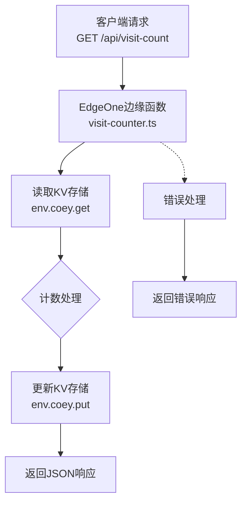
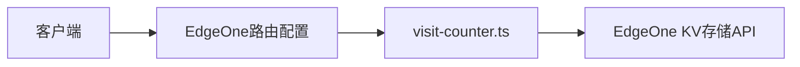
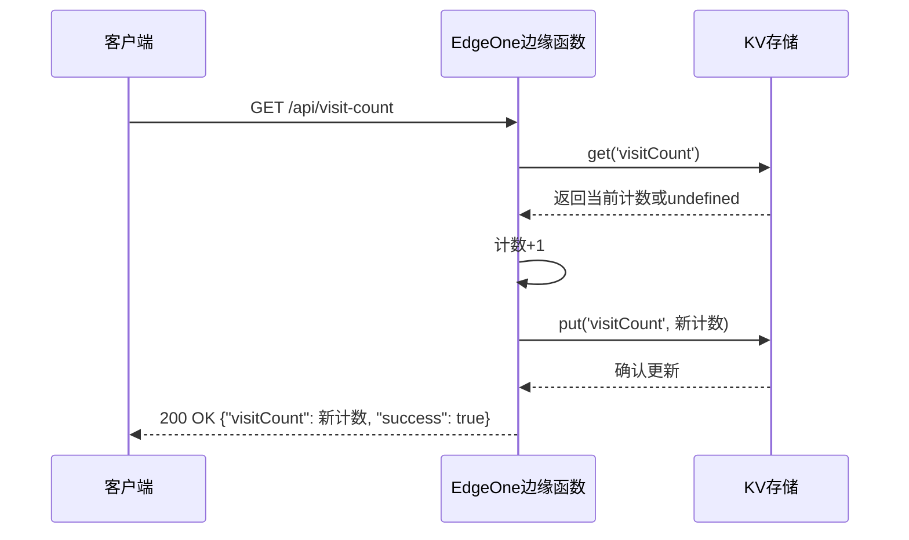

# 访问计数功能 - 设计文档

## 1. 整体架构图



## 2. 分层设计

### 2.1 接入层
- **API接口**：`GET /api/visit-count`
- **功能**：接收客户端请求，路由到对应的处理函数

### 2.2 业务逻辑层
- **边缘函数**：`visit-counter.ts`
- **核心组件**：
  - `onRequestGet`：处理GET请求
  - `handler`：默认入口函数，处理HTTP方法路由

### 2.3 数据访问层
- **KV存储**：使用EdgeOne KV存储
- **键名**：`visitCount`
- **操作**：读取、更新

## 3. 模块依赖关系



## 4. 接口契约定义

### 4.1 API接口
- **路径**：`/api/visit-count`
- **方法**：`GET`
- **请求头**：无特殊要求
- **请求体**：无
- **响应格式**：
  ```json
  {
    "visitCount": 1,
    "success": true
  }
  ```
- **错误响应**：
  ```json
  {
    "success": false,
    "error": "错误信息"
  }
  ```
- **状态码**：
  - `200`：成功
  - `405`：不支持的方法
  - `500`：服务器错误

## 5. 数据流向图



## 6. 异常处理策略

### 6.1 异常类型与处理
- **KV读取失败**：返回初始计数1并记录错误
- **KV写入失败**：返回成功获取的计数但记录写入失败
- **参数错误**：返回400错误
- **方法不支持**：返回405错误
- **其他未预期错误**：返回500错误并包含错误信息

### 6.2 错误日志
- 使用`console.error`记录详细错误信息
- 包含错误类型、消息和可能的堆栈信息

## 7. 性能优化考虑

- **异步操作**：确保KV读写操作使用异步处理，避免阻塞
- **最小化操作**：仅执行必要的KV操作，减少网络调用
- **错误恢复**：在KV操作失败时提供合理的降级方案