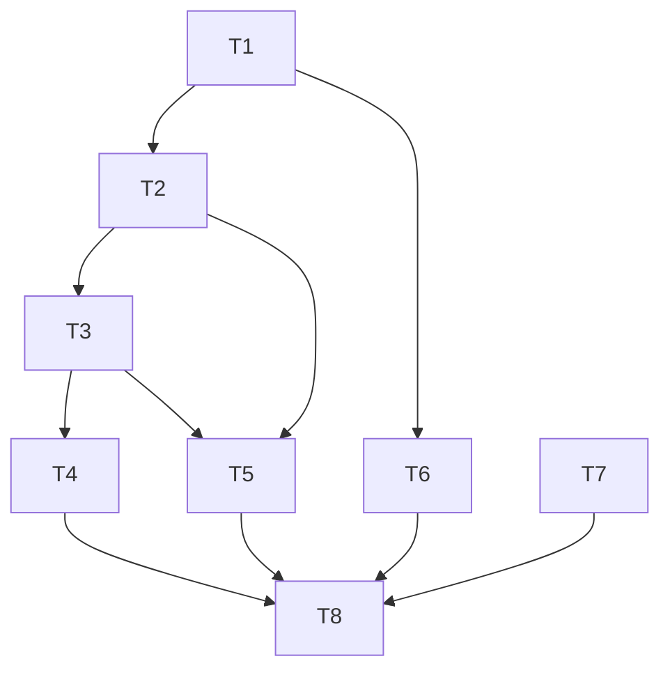

# 访问计数功能 - 任务拆分文档

## 1. 任务拆分列表

| 任务ID | 任务名称 | 输入契约 | 输出契约 | 实现约束 | 依赖关系 |
|--------|----------|----------|----------|----------|----------|
| T1     | 创建边缘函数文件 | EdgeOne环境配置 | visit-counter.ts文件 | TypeScript语法规范 | 无 |
| T2     | 实现KV读取逻辑 | visit-counter.ts文件 | 正确读取KV存储的访问计数 | 处理初始值为undefined的情况 | T1 |
| T3     | 实现计数更新逻辑 | KV读取结果 | 正确更新计数并写入KV | 异步操作处理 | T2 |
| T4     | 实现响应生成逻辑 | 更新后的计数 | 格式正确的JSON响应 | 包含CORS头信息 | T3 |
| T5     | 实现错误处理机制 | 可能的异常情况 | 错误响应和日志记录 | 区分不同类型错误 | T2, T3 |
| T6     | 实现默认入口函数 | visit-counter.ts文件 | 支持HTTP方法路由 | 处理不支持的方法 | T1 |
| T7     | 更新EdgeOne配置 | edgeone.json文件 | 新增访问计数API路由 | 遵循现有配置格式 | 无 |
| T8     | 代码质量检查 | 所有实现代码 | 符合规范的代码 | 包含完整注释、异常处理 | T1-T7 |

## 2. 任务依赖图

## 3. 原子任务详情

### T1: 创建边缘函数文件
- **目标**: 创建visit-counter.ts文件
- **输入**: EdgeOne环境配置信息
- **输出**: 基础边缘函数文件结构
- **实现约束**:
  - 使用TypeScript
  - 遵循EdgeOne函数格式
  - 包含文件级注释

### T2: 实现KV读取逻辑
- **目标**: 从KV存储读取当前访问计数
- **输入**: 函数上下文和环境变量
- **输出**: 当前访问计数
- **实现约束**:
  - 使用`env.coey.get()`
  - 处理初始值为undefined的情况
  - 转换为数字类型

### T3: 实现计数更新逻辑
- **目标**: 将访问计数加1并写回KV存储
- **输入**: 当前访问计数
- **输出**: 更新后的计数和KV存储确认
- **实现约束**:
  - 使用`env.coey.put()`
  - 确保异步处理
  - 计数转换为字符串存储

### T4: 实现响应生成逻辑
- **目标**: 生成格式正确的JSON响应
- **输入**: 更新后的计数
- **输出**: Response对象
- **实现约束**:
  - JSON格式响应体
  - 包含CORS头信息
  - 200状态码

### T5: 实现错误处理机制
- **目标**: 捕获和处理所有可能的错误
- **输入**: 执行过程中的异常
- **输出**: 错误响应或降级处理
- **实现约束**:
  - try-catch包装所有异步操作
  - 适当的错误日志
  - 500状态码和错误信息

### T6: 实现默认入口函数
- **目标**: 创建支持HTTP方法路由的默认函数
- **输入**: Request对象和环境变量
- **输出**: 路由到对应处理函数的响应
- **实现约束**:
  - 仅支持GET方法
  - 对不支持的方法返回405
  - TypeScript类型定义

### T7: 更新EdgeOne配置
- **目标**: 在edgeone.json中添加新路由
- **输入**: 现有的edgeone.json文件
- **输出**: 更新后的配置文件
- **实现约束**:
  - 路径设为`/api/visit-count`
  - 函数路径指向`edge-functions/visit-counter.ts`

### T8: 代码质量检查
- **目标**: 确保所有代码符合质量标准
- **输入**: 所有已实现的代码
- **输出**: 质量检查报告
- **实现约束**:
  - 完整的函数注释
  - 错误处理覆盖
  - 代码风格一致

## 4. 优先级

1. **最高优先级**: T1, T2, T3, T4, T7 - 核心功能实现和配置
2. **高优先级**: T5, T6 - 错误处理和HTTP方法支持
3. **中优先级**: T8 - 代码质量优化