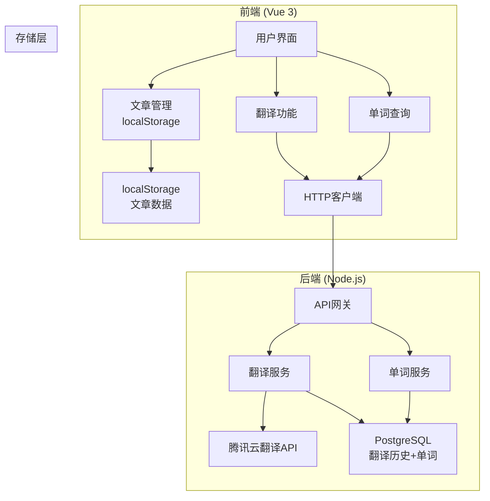
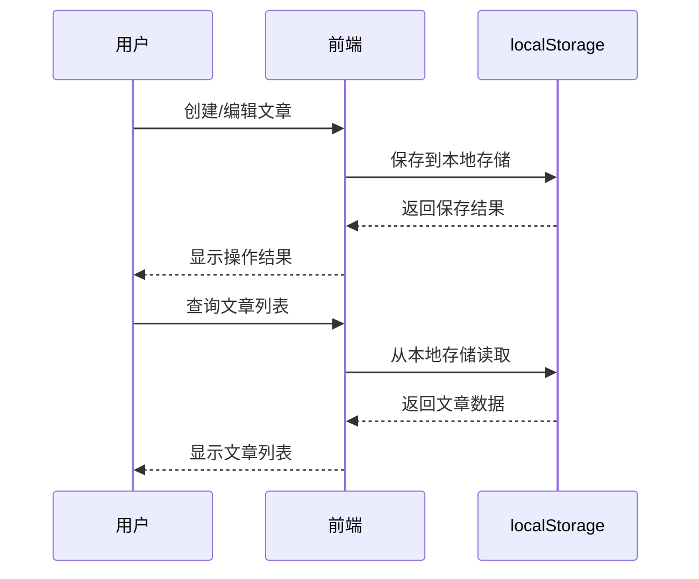
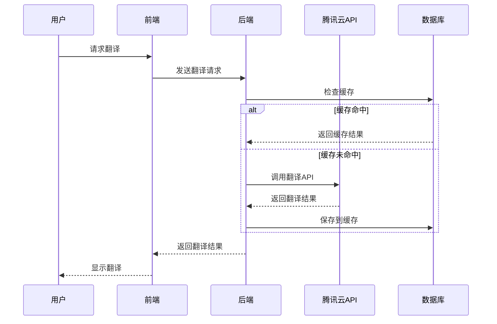

# 简化版完形填空系统架构说明

## 系统概述

本系统是一个英语学习平台，专注于段落翻译和单词学习功能。经过架构简化，文章管理功能已迁移到前端localStorage，减少了服务器负载并提升了用户体验。

## 架构图



## 技术栈

### 前端技术栈

| 技术 | 版本 | 用途 |
|------|------|------|
| Vue 3 | 3.x | 前端框架 |
| TypeScript | 5.x | 类型安全 |
| Vite | 5.x | 构建工具 |
| Pinia | 2.x | 状态管理 |
| Vue Router | 4.x | 路由管理 |
| Vant | 4.x | UI组件库 |
| Axios | 1.x | HTTP客户端 |

### 后端技术栈

| 技术 | 版本 | 用途 |
|------|------|------|
| Node.js | 16+ | 运行时环境 |
| TypeScript | 5.x | 类型安全 |
| Express.js | 4.x | Web框架 |
| PostgreSQL | 14+ | 关系型数据库 |
| Redis | 6+ | 缓存（可选） |

## 数据流向

### 文章管理流程



### 翻译功能流程



## 模块设计

### 前端模块

#### 1. 文章管理模块 (Essay Management)

**位置**: `src/store/index.ts`, `src/utils/essayService.ts`

**功能**:
- 文章的增删改查
- 本地存储管理
- 数据导入导出

**数据结构**:
```typescript
interface Essay {
  id: string
  title: string
  content: string
  difficulty: 'easy' | 'medium' | 'hard'
  category: string
  tags: string[]
  createTime: string
}
```

#### 2. 翻译模块 (Translation)

**位置**: `src/utils/translateService.ts`

**功能**:
- 段落翻译
- 批量翻译
- 翻译缓存
- 自动保存翻译历史

#### 3. 单词查询模块 (Word Query)

**位置**: `src/utils/wordService.ts`

**功能**:
- 单词翻译查询
- 本地词典
- 高级词汇标记
- 文本分词

### 后端模块

#### 1. 翻译服务 (Translation Service)

**位置**: `backend/src/services/translationService.ts`

**功能**:
- 腾讯云翻译API集成
- 翻译结果缓存
- 翻译历史记录

#### 2. 单词服务 (Word Service)

**位置**: `backend/src/services/wordService.ts`

**功能**:
- 单词信息存储
- 单词查询接口
- 词汇统计

## 数据存储设计

### localStorage 存储结构

```javascript
// 文章数据
localStorage.setItem('essays', JSON.stringify([
  {
    id: 'essay_1',
    title: 'Sample Essay',
    content: 'Essay content...',
    difficulty: 'medium',
    category: 'reading',
    tags: ['education', 'english'],
    createTime: '2024-01-01T00:00:00.000Z'
  }
]))

// 用户设置
localStorage.setItem('userSettings', JSON.stringify({
  theme: 'light',
  language: 'zh-CN',
  autoSave: true
}))
```

### PostgreSQL 数据库设计

#### 翻译历史表 (translation_history)

```sql
CREATE TABLE translation_history (
  id SERIAL PRIMARY KEY,
  original_text TEXT NOT NULL,
  translated_text TEXT NOT NULL,
  source_language VARCHAR(10) DEFAULT 'en',
  target_language VARCHAR(10) DEFAULT 'zh',
  created_at TIMESTAMP DEFAULT CURRENT_TIMESTAMP
);
```

#### 单词表 (words)

```sql
CREATE TABLE words (
  id SERIAL PRIMARY KEY,
  word VARCHAR(100) UNIQUE NOT NULL,
  translation TEXT NOT NULL,
  pronunciation VARCHAR(200),
  created_at TIMESTAMP DEFAULT CURRENT_TIMESTAMP,
  updated_at TIMESTAMP DEFAULT CURRENT_TIMESTAMP
);
```

## 性能优化

### 前端优化

1. **组件懒加载**
   ```typescript
   const Display = defineAsyncComponent(() => import('./views/Display.vue'))
   ```

2. **localStorage 优化**
   - 数据压缩存储
   - 定期清理过期数据
   - 分页加载大量数据

3. **缓存策略**
   - 翻译结果本地缓存
   - 组件级别缓存
   - 静态资源缓存

### 后端优化

1. **数据库优化**
   - 索引优化
   - 连接池配置
   - 查询优化

2. **API优化**
   - 请求限流
   - 响应压缩
   - 缓存策略

## 安全考虑

### 前端安全

1. **数据验证**
   - 输入数据校验
   - XSS防护
   - 敏感信息过滤

2. **存储安全**
   - localStorage数据加密
   - 敏感信息不存储在本地

### 后端安全

1. **API安全**
   - 请求频率限制
   - 参数验证
   - 错误信息过滤

2. **数据库安全**
   - SQL注入防护
   - 连接加密
   - 访问权限控制

## 扩展性设计

### 水平扩展

1. **前端扩展**
   - CDN部署
   - 多地域部署
   - 负载均衡

2. **后端扩展**
   - 微服务架构
   - 容器化部署
   - 自动伸缩

### 功能扩展

1. **新功能模块**
   - 插件化架构
   - 模块化设计
   - API版本控制

2. **第三方集成**
   - 多翻译引擎支持
   - 语音识别集成
   - 智能推荐系统