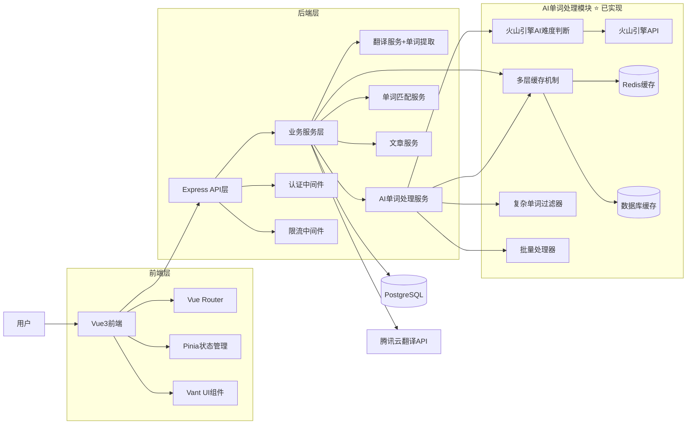

# 🏗️ 设计文档

## 一、系统架构图


## 二、模块设计

### 2.1 核心模块
| 模块名 | 职责说明 | 主要类/方法 |
|--------|----------|-------------|
| TranslationService | 处理段落翻译与缓存 | translateParagraph(), getCachedTranslation() |
| **SimplifiedWordService** ⭐ | **AI单词智能处理（已实现）** | **processWord(), batchProcessWords(), filterComplexWords()** |
| WordService | 单词数据管理 | getWordFromDatabase(), saveWord() |
| EssayService | 文章管理和存储 | saveEssay(), getEssayList() |
| ThemeService | 主题切换功能 | toggleTheme(), applyTheme() |

### 2.2 已移除模块 🗑️
| 模块名 | 移除原因 | 移除日期 |
|--------|----------|----------|
| **TranslationStatsService** | **非核心功能，简化系统复杂度** | **2024-12-XX** |
| **RealTimeProgressService** | **实时提示功能影响用户体验** | **2024-12-XX** |

### 2.3 AI单词处理模块详细设计

#### 2.3.1 EnhancedWordService
```typescript
class EnhancedWordService {
  // 单个单词AI处理
  async processWord(word: string): Promise<AIWordResult>
  
  // 批量单词处理
  async batchProcess(words: string[]): Promise<AIWordResult[]>
  
  // 复杂单词过滤
  async filterComplexWords(words: string[]): Promise<string[]>
  
  // 翻译必要性检查
  async checkTranslationNeed(word: string, translation: string): Promise<boolean>
  
  // 配置状态检查
  async getConfigStatus(): Promise<ConfigStatus>
}
```

#### 2.3.2 WordDifficultyJudge（难度判断引擎）
```typescript
class WordDifficultyJudge {
  // 基于规则的难度判断
  judgeByRules(word: string): number
  
  // AI服务难度判断（预留接口）
  async judgeByAI(word: string): Promise<number>
  
  // 综合判断
  async judge(word: string): Promise<DifficultyResult>
}
```

#### 2.3.3 判断规则算法
```typescript
// 难度判断规则
const DIFFICULTY_RULES = {
  // 基础规则：单词长度
  lengthRules: {
    1-3: 1,    // 极简单
    4-5: 2-3,  // 简单
    6-8: 4-6,  // 中等
    9-12: 7-8, // 困难
    13+: 9-10  // 极困难
  },
  
  // 常用词汇规则
  commonWords: {
    high: -2,    // 高频词降低难度
    medium: 0,   // 中频词不变
    low: +2      // 低频词增加难度
  },
  
  // 词性规则
  partOfSpeech: {
    noun: 0,
    verb: +1,
    adjective: +1,
    adverb: +2
  }
}
```

## 三、数据库设计

### 3.1 核心表结构
| 表名 | 字段 | 类型 | 说明 |
|------|------|------|------|
| **words** | id | serial | 主键 |
| **words** | word | varchar(100) | 英文单词 |
| **words** | pronunciation | varchar(100) | 发音 |
| **words** | **definition** ⭐ | text | **英文定义** |
| **words** | translation | varchar(200) | 中文翻译 |
| **words** | **part_of_speech** ⭐ | varchar(50) | **词性** |
| **words** | **difficulty_level** ⭐ | integer | **难度等级(1-10)** |
| **words** | **frequency_rank** ⭐ | integer | **词频排名** |
| **words** | **example_sentences** ⭐ | text | **例句** |
| **words** | **synonyms** ⭐ | text | **同义词** |
| **words** | **antonyms** ⭐ | text | **反义词** |
| **words** | **etymology** ⭐ | text | **词源** |
| **words** | **is_active** ⭐ | boolean | **是否活跃** |
| **words** | created_at | timestamp | 创建时间 |
| **words** | updated_at | timestamp | 更新时间 |

### 3.2 索引设计
```sql
-- 单词查询索引
CREATE INDEX idx_words_word ON words(word);

-- 难度等级索引
CREATE INDEX idx_words_difficulty ON words(difficulty_level);

-- 词频排名索引
CREATE INDEX idx_words_frequency ON words(frequency_rank);

-- 复合索引：活跃状态+难度
CREATE INDEX idx_words_active_difficulty ON words(is_active, difficulty_level);
```

## 四、API设计架构

### 4.1 路由层次结构
```
/api/v1/
├── /translate/          # 翻译相关
│   ├── /paragraph       # 段落翻译
│   └── /history         # 翻译历史
├── /ai-words/          # AI单词处理 ⭐
│   ├── /process        # 单个单词处理
│   ├── /batch-process  # 批量处理
│   ├── /filter-complex # 复杂单词过滤
│   ├── /check-translation # 翻译检查
│   └── /config-status  # 配置状态
├── /words/             # 单词管理
│   ├── /:word          # 单词查询
│   └── /search         # 单词搜索
└── /health             # 健康检查
```

### 4.2 中间件架构
```typescript
// 请求处理流程
Request → CORS → RateLimit → Validation → Controller → Service → Repository → Database
                                    ↓
                              ErrorHandler → Response
```

## 五、异常与并发处理

### 5.1 错误处理策略
```typescript
// 统一错误码
enum ErrorCode {
  SUCCESS = "SUCCESS",
  PARAM_ERROR = "ERROR_001",
  TRANSLATION_ERROR = "ERROR_002", 
  DATABASE_ERROR = "ERROR_003",
  API_QUOTA_ERROR = "ERROR_004",
  AI_SERVICE_ERROR = "ERROR_005", // 新增
  INTERNAL_ERROR = "ERROR_500"
}
```

### 5.2 并发处理
- **批量处理并发控制**: 使用Promise.allSettled限制并发数量
- **数据库连接池**: PostgreSQL连接池管理
- **Redis锁机制**: 防止重复处理相同单词
- **API限流**: express-rate-limit中间件

### 5.3 缓存策略
```typescript
// 缓存层次
L1: 内存缓存 (单词基础信息, TTL: 1小时)
L2: Redis缓存 (翻译结果, TTL: 24小时)  
L3: 数据库 (持久化存储)
```

## 六、性能优化设计

### 6.1 数据库优化
- 合理的索引设计
- 查询语句优化
- 连接池配置
- 读写分离（预留）

### 6.2 缓存优化
- 多级缓存策略
- 缓存预热机制
- 缓存失效策略
- 缓存穿透防护

### 6.3 API优化
- 批量处理减少请求次数
- 响应数据压缩
- 异步处理长时间任务
- 请求去重机制

## 七、安全设计

### 7.1 输入验证
- 参数类型检查
- 长度限制
- 特殊字符过滤
- SQL注入防护

### 7.2 API安全
- 请求频率限制
- 跨域配置
- 敏感信息脱敏
- 日志安全记录

## 八、监控与日志

### 8.1 日志设计
```typescript
// 日志级别
enum LogLevel {
  ERROR = "error",
  WARN = "warn", 
  INFO = "info",
  DEBUG = "debug"
}

// 日志格式
{
  timestamp: "2024-12-24T10:00:00Z",
  level: "info",
  service: "ai-word-service",
  action: "process_word",
  word: "sophisticated",
  duration: 120,
  result: "success"
}
```

### 8.2 性能监控
- API响应时间监控
- 数据库查询性能
- 缓存命中率统计
- 错误率监控

## 九、扩展性设计

### 9.1 AI服务扩展
- 支持多种AI服务提供商
- 服务降级和容错
- 配置化AI模型选择
- A/B测试支持

### 9.2 功能扩展
- 用户个性化难度调整
- 学习进度跟踪
- 智能推荐算法
- 多语言支持